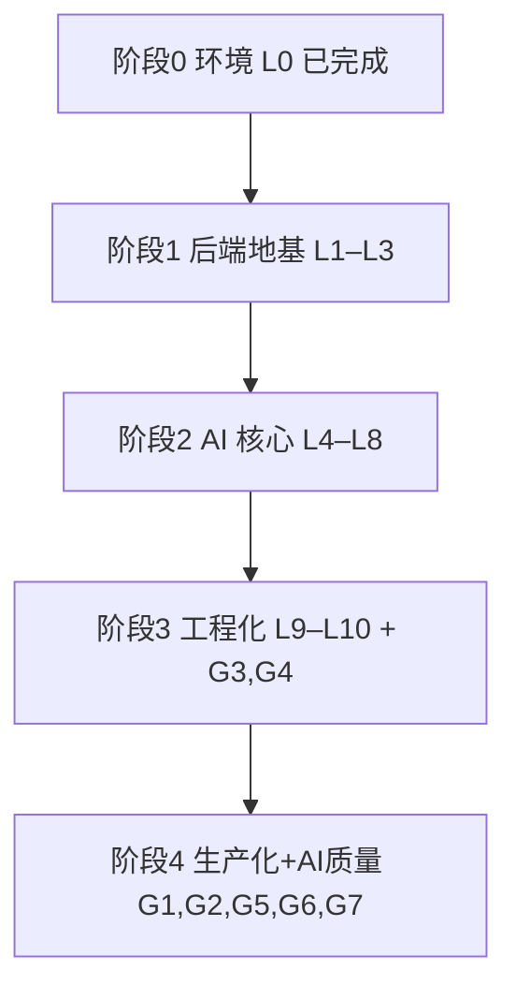

# 学习行动计划 — 从前端到 Java + AI 全栈

> **我是谁**：在职前端（React + TS 熟练），有一定 Java 基础，正把能力边界从前端向 Java 后端 + AI 应用全栈扩展。
> **学习载体**：本仓库（Spring Boot 4.1 + Java 21 + Spring AI 2.0 + PostgreSQL/pgvector + Redis + React）。
> **我的方式（learning in public）**：公开记录「读懂真实实现 → 补齐背后概念 → 动手改一点 → 沉淀成可复用笔记」的全过程，把踩过的坑和验证结论都开源出来，让走同一条路（前端转 Java + AI）的人少走弯路。
> **修订（2026-07-16）**：重构为「先吃透本项目的 Java AI 全栈实现，再补齐它没覆盖的生产化能力」。

---

## 一、我要建立的 AI 全栈能力地图

下面是我梳理的「一个 Java AI 全栈应用需要哪些能力」，以及本项目的覆盖情况——这也是我判断「先学什么、还缺什么」的依据。

| 能力域          | 具体内容                                   | 本项目              |
| ------------ | -------------------------------------- | ---------------- |
| Java 后端地基    | Spring Boot 分层、DI、JPA、事务、统一响应/异常、配置管理  | ✅ 完整             |
| LLM 接入       | 多 Provider、ChatClient、流式、结构化输出、重试      | ✅ 完整             |
| Prompt 工程    | 模板管理、注入防护、结构化约束                        | ✅ 有              |
| RAG          | 向量库、embedding、检索、Query Rewrite、TopK/阈值 | ✅ 完整             |
| Agent / 工具调用 | tool-calling、技能编排                      | ✅ 有（agent-utils） |
| 异步 / 消息      | 队列解耦、可靠消费、重试/死信                        | ✅ Redis Stream   |
| 实时通信         | WebSocket / SSE 流式                     | ✅ 完整             |
| 可观测性         | 指标、健康检查（追踪待补）                          | 🟡 半             |
| 工程质量         | 限流、异常体系、测试                             | 🟡 半             |
| 生产化          | 认证鉴权、DB 迁移、部署、CI/CD                    | ❌ 缺              |
| AI 质量保障      | 评测/eval、幻觉与检索质量度量                      | 🟡 有评分无 eval     |
| 前端对接         | SSE/WebSocket、类型安全、流式 UI               | ✅ 完整             |

本项目已经覆盖了其中大部分核心能力，我先把这些真实实现吃透；剩下的「生产化 + AI 质量保障」是项目里没有的，我自己动手补上并公开记录——这两块既是我最想搞懂的，也是笔记里对他人最有参考价值的干货。

---

## 二、本项目里我要系统深挖的技术亮点（L 系列）

> 每个亮点 = 读源码 → 建立概念 → 做一个小验证 → 沉淀笔记。  
> **编号按学习阶段连续排列**（2026-08-01）：阶段 1 = L1–L3，阶段 2 = L4–L8，阶段 3 = L9–L10；L0 为环境前置。  
> **功能模块**列链到 [modules/](notes/modules/README.md)；**笔记**列 = 模块篇（在哪用）+ tech-qa（怎么讲）。

### 阶段 0 · 环境（前置）

| # | 主题 | 用在哪些功能模块（怎么用） | 读什么（核心源码） | 笔记 |
|---|------|---------------------------|-------------------|------|
| L0 | 环境与工程基建 ✅ | **全模块共用基建**：PG / Redis / RustFS / Docker；ddl-auto 陷阱直接影响所有表 | `docker-compose.dev.yml`、启动日志 | [01 启动](notes/01-env-setup.md) · [tech-qa/02](notes/tech-qa/02-jpa-transaction.md) |

### 阶段 1 · 后端地基（L1–L3）

| # | 主题 | 用在哪些功能模块（怎么用） | 读什么（核心源码） | 笔记 |
|---|------|---------------------------|-------------------|------|
| L1 | Spring Boot 三层地基 | **全部业务模块**共用分层约定；最小闭环看 [日程](notes/modules/05-interviewschedule.md)；编排更完整看 [文字问答](notes/modules/02-interview.md) | Controller/Service/Repository；`common/result`、`exception`、`config/*Properties` | [modules/05](notes/modules/05-interviewschedule.md) · [modules/02](notes/modules/02-interview.md) · [tech-qa/01](notes/tech-qa/01-spring-boot.md) |
| L2 | 限流与横切（AOP） | 注解挂在各 Controller：[简历](notes/modules/01-resume.md) 上传/重分析；[文字问答](notes/modules/02-interview.md) 建会话/交答案/JD；[知识库](notes/modules/04-knowledgebase.md) 查询/上传；[模型配置](notes/modules/06-llmprovider.md) 读写/测试 | `RateLimitAspect`、`@RateLimit` | [modules/01](notes/modules/01-resume.md) · [modules/04](notes/modules/04-knowledgebase.md) · [modules/06](notes/modules/06-llmprovider.md) · [tech-qa/10](notes/tech-qa/10-observability-rate-limit.md) |
| L3 | 统一评估 + 文件/导出 | **评估**：[文字问答](notes/modules/02-interview.md) + [语音](notes/modules/03-voiceinterview.md) 共用引擎；**文件/解析/导出**：[简历](notes/modules/01-resume.md) + [知识库](notes/modules/04-knowledgebase.md) | `UnifiedEvaluationService`、`infrastructure/file/*`、`export/` | [modules/02](notes/modules/02-interview.md) · [modules/03](notes/modules/03-voiceinterview.md) · [modules/01](notes/modules/01-resume.md) · [tech-qa/11](notes/tech-qa/11-ai-quality-evaluation.md) · [tech-qa/09](notes/tech-qa/09-file-storage-parsing.md) |

### 阶段 2 · AI 核心（L4–L8）

| # | 主题 | 用在哪些功能模块（怎么用） | 读什么（核心源码） | 笔记 |
|---|------|---------------------------|-------------------|------|
| L4 | Spring AI 多 Provider | **配置中枢** [模型配置](notes/modules/06-llmprovider.md)；**调用方**：[简历](notes/modules/01-resume.md) / [文字问答](notes/modules/02-interview.md) / [语音](notes/modules/03-voiceinterview.md) / [知识库](notes/modules/04-knowledgebase.md) / [日程](notes/modules/05-interviewschedule.md) | `LlmProviderRegistry`、`modules/llmprovider/*` | [modules/06](notes/modules/06-llmprovider.md) · [tech-qa/04](notes/tech-qa/04-llm-integration.md) |
| L5 | 结构化输出与可靠性 | [简历](notes/modules/01-resume.md) 评分；[文字问答](notes/modules/02-interview.md) 出题 / JD / 评估；[日程](notes/modules/05-interviewschedule.md) 文本抽取 | `StructuredOutputInvoker`、各评分/出题/解析 Service | [modules/01](notes/modules/01-resume.md) · [modules/02](notes/modules/02-interview.md) · [tech-qa/11](notes/tech-qa/11-ai-quality-evaluation.md) |
| L6 | Prompt 工程与注入防护 | [文字问答](notes/modules/02-interview.md)、[简历](notes/modules/01-resume.md)、[知识库](notes/modules/04-knowledgebase.md)、[语音](notes/modules/03-voiceinterview.md)、[日程](notes/modules/05-interviewschedule.md) | `PromptSanitizer`、`resources/prompts/*.st` | [modules/02](notes/modules/02-interview.md) · [modules/04](notes/modules/04-knowledgebase.md) · [tech-qa/05](notes/tech-qa/05-prompt-engineering.md) |
| L7 | RAG 检索增强全链路 | 主战场 [知识库](notes/modules/04-knowledgebase.md)；Embedding 配置在 [模型配置](notes/modules/06-llmprovider.md) | `KnowledgeBaseVectorService`、`KnowledgeBaseQueryService`、`VectorizeStream*` | [modules/04](notes/modules/04-knowledgebase.md) · [tech-qa/06](notes/tech-qa/06-rag.md) |
| L8 | Agent / 工具调用 | [文字问答](notes/modules/02-interview.md) 技能包；[语音](notes/modules/03-voiceinterview.md) voice ChatClient；装配在 [模型配置](notes/modules/06-llmprovider.md) | `AgentUtilsConfiguration`、`resources/skills/`、Registry 三变体 | [modules/02](notes/modules/02-interview.md) · [modules/03](notes/modules/03-voiceinterview.md) · [tech-qa/07](notes/tech-qa/07-tool-calling-agent.md) |

### 阶段 3 · 工程化（L9–L10）

| # | 主题 | 用在哪些功能模块（怎么用） | 读什么（核心源码） | 笔记 |
|---|------|---------------------------|-------------------|------|
| L9 | Redis Stream 异步 | [简历](notes/modules/01-resume.md) `resume:analyze`；[文字问答](notes/modules/02-interview.md) `interview:evaluate`；[语音](notes/modules/03-voiceinterview.md) `voice:evaluate`；[知识库](notes/modules/04-knowledgebase.md) `knowledge:vectorize` | `AbstractStreamProducer`/`Consumer`、各模块 `listener/` | [modules/01](notes/modules/01-resume.md) · [modules/02](notes/modules/02-interview.md) · [modules/04](notes/modules/04-knowledgebase.md) · [tech-qa/03](notes/tech-qa/03-redis.md) |
| L10 | 实时语音 WebSocket | 主战场 [语音问答](notes/modules/03-voiceinterview.md)；同属流式的 SSE 在 [知识库](notes/modules/04-knowledgebase.md) | `VoiceInterviewWebSocketHandler`、ASR/TTS/LLM Service | [modules/03](notes/modules/03-voiceinterview.md) · [modules/04](notes/modules/04-knowledgebase.md) · [tech-qa/08](notes/tech-qa/08-ai-app-dev-workflow.md) |

> 备注：列表查询的 JPQL 投影分析属常规查询优化，落在 [文字问答](notes/modules/02-interview.md)，分析见 [tech-qa/02](notes/tech-qa/02-jpa-transaction.md)，挂在 L1 地基下练习即可，不单列学习项。

---

## 三、本项目没覆盖、我要补齐的工程化能力（G 系列）

> 这些是本项目**没有或很弱**、但一个能真正上线的 AI 应用绕不开的能力。

| #   | 主题        | 现状 → 我要加什么                                                                                                         | 我的验收                                                   | 笔记                                                                                                         |
| --- | --------- | ------------------------------------------------------------------------------------------------------------------ | ------------------------------------------------------ | ---------------------------------------------------------------------------------------------------------- |
| G1  | 认证与鉴权     | 接口裸奔 → `spring-boot-starter-security` + JWT 登录 + `SecurityFilterChain` + `@PreAuthorize`，按用户隔离                     | 未登录 401、越权 403、`/api/**` 需 token                       | ⬜ 待新增                                                                                                      |
| G2  | 数据库迁移     | 靠 ddl-auto（[tech-qa/02](notes/tech-qa/02-jpa-transaction.md) 踩过丢数据）→ Flyway `V1__init.sql`，`ddl-auto` 改 `validate` | 重启不依赖自动建表、可版本化回滚                                       | [tech-qa/02 缺口](notes/tech-qa/02-jpa-transaction.md) · ⬜ 待新增 Flyway 专篇                                     |
| G3  | 分布式追踪与日志  | 只有指标 → `micrometer-tracing` + OTel/Zipkin，日志加 MDC，覆盖一次 RAG/简历链路                                                    | 一次请求能看到跨 Service/Stream 的 span                         | [tech-qa/10 缺口](notes/tech-qa/10-observability-rate-limit.md) · ⬜ 待新增                                      |
| G4  | 测试体系      | Redis 测试多 `@Disabled` → Testcontainers 起真 Redis/PG，Mock S3/LLM 跑全链路                                                | `./gradlew :app:test` 默认跑通链路（PENDING→COMPLETED/FAILED） | 增补 [tech-qa/03](notes/tech-qa/03-redis.md) · [modules/01](notes/modules/01-resume.md)                      |
| G5  | AI 质量评估   | 有评分无 eval → 建 20~30 条评测集，Java 内 LLM-as-judge 度量 faithfulness/命中率                                                   | 「参数改动 → 指标变化」对比表 + 结论                                  | [tech-qa/11 最小方案](notes/tech-qa/11-ai-quality-evaluation.md) · ⬜ 待落地                                       |
| G6  | 容器化与 CI   | 有 compose 无流水线 → 多阶段 `Dockerfile` + 全栈 compose + GitHub Actions                                                    | 一条命令起全栈、PR 触发 CI（build + test）                         | ⬜ 待新增                                                                                                      |
| G7  | SSE 流式可靠性 | 断网丢已渲染内容 → `frontend/src/api/stream.ts` 指数退避重试 + 内容保留/按 messageId 补齐                                               | 断网可恢复且不丢已渲染内容                                          | 增补 [tech-qa/08](notes/tech-qa/08-ai-app-dev-workflow.md) · [modules/04](notes/modules/04-knowledgebase.md) |

---

## 四、分阶段学习路线

| 阶段 | 目标 | 学习项 | 主要产出 |
|------|------|--------|----------|
| 0 环境 | 全套本地跑通 | L0 | [01 启动](notes/01-env-setup.md) |
| 1 后端地基 | 能读懂/改任一模块 | L1–L3 | [tech-qa/01](notes/tech-qa/01-spring-boot.md)、[tech-qa/10](notes/tech-qa/10-observability-rate-limit.md)、[tech-qa/09](notes/tech-qa/09-file-storage-parsing.md)、[tech-qa/11](notes/tech-qa/11-ai-quality-evaluation.md) |
| 2 AI 核心 | 掌握 LLM/RAG/Agent | L4–L8 | [modules/06](notes/modules/06-llmprovider.md)、[tech-qa/04](notes/tech-qa/04-llm-integration.md)、[tech-qa/05](notes/tech-qa/05-prompt-engineering.md)、[modules/04](notes/modules/04-knowledgebase.md)、[tech-qa/06](notes/tech-qa/06-rag.md)、[tech-qa/07](notes/tech-qa/07-tool-calling-agent.md) |
| 3 工程化 | 异步/实时/可观测/可测 | L9–L10、G3、G4 | [tech-qa/03](notes/tech-qa/03-redis.md)、[modules/03](notes/modules/03-voiceinterview.md)、[tech-qa/08](notes/tech-qa/08-ai-app-dev-workflow.md) + 集成测试 |
| 4 生产化 | 认证/迁移/评估/部署 | G1、G2、G5、G6、G7 | 待新增专篇；缺口说明已挂在对应 tech-qa / modules |

**我的执行原则**（对齐当前笔记：`modules/` + `tech-qa/`）：

1. **先对模块、再挖技术**：学某个 L 项时，先读 [modules/](notes/modules/README.md) 看「这条业务链路怎么走、技术落在哪」；再读 [tech-qa/](notes/tech-qa/README.md) 把同一技术讲成「问题 → 简答 → 本仓库落点」。两边互相链接，不拆成两套互不相关的笔记。
2. **笔记已成篇 ≠ 学完**：L 系列多数已有 modules / tech-qa 成稿（状态 📝）；下一步是对照笔记做小验证（改一行配置、加一条测试、补一个指标），把 ⚠️ 缺口和「待补」动手项真正关掉。
3. **动手产出写回两处**：代码改动进 `code-changes/`；新结论优先补进已有 tech-qa 问答或对应 modules 篇，而不是再开一条平行编号的笔记。
4. **G 系列按缺口挂靠**：生产化能力（鉴权、Flyway、traceId、集成测试、RAG eval、SSE 重试等）优先增补进已标缺口的 tech-qa / modules 篇；只有现有篇装不下时才新建专篇。

---

## 五、笔记索引（按 L / G 分类）

完整目录索引也可从 [my-learning/README.md](README.md) 进入。

**笔记组织约定**（2026-08-01 重排）

不再用单一序列编号，改成「项目全貌 + 两个方向」：

- `[notes/01–03](#51-项目全貌)`：项目全貌——本地启动、功能全景、库表设计。
- `[notes/modules/](notes/modules/README.md)`：**方向一**，按业务模块各一篇，讲清链路与该模块涉及的技术面。
- `[notes/tech-qa/](notes/tech-qa/README.md)`：**方向二**，按核心技术各一篇高频问答（问题 → 简答 → 本仓库落点）。
- 一个 L/G 项通常横跨两个方向：模块篇给「在哪用」，tech-qa 篇给「怎么讲清楚」。

### 5.1 项目全貌

| 笔记                                               | 讲什么                        |
| ------------------------------------------------ | -------------------------- |
| [01 本地启动](notes/01-env-setup.md)                 | Docker 基础设施 + 后端/前端启动 + 踩坑 |
| [02 功能全景](notes/02-project-features-overview.md) | 六大模块能力、页面路由、流程图            |
| [03 库表设计](notes/03-db-schema-design.md)          | 表字段、关系、状态机                 |

### 5.2 方向一 · 按业务模块

| 笔记                                               | 模块                  |
| ------------------------------------------------ | ------------------- |
| [01 简历分析](notes/modules/01-resume.md)            | `resume`            |
| [02 文字模拟问答](notes/modules/02-interview.md)       | `interview`         |
| [03 实时语音问答](notes/modules/03-voiceinterview.md)  | `voiceinterview`    |
| [04 知识库与 RAG](notes/modules/04-knowledgebase.md) | `knowledgebase`     |
| [05 日程管理](notes/modules/05-interviewschedule.md) | `interviewschedule` |
| [06 模型与语音配置](notes/modules/06-llmprovider.md)    | `llmprovider`       |

索引：[modules/README.md](notes/modules/README.md)

### 5.3 方向二 · 按核心技术问答

| 笔记                                                                | 主题                            |
| ----------------------------------------------------------------- | ----------------------------- |
| [01 Spring Boot](notes/tech-qa/01-spring-boot.md)                 | IoC/DI、三层、统一响应/异常、事务边界、AOP    |
| [02 JPA 与事务](notes/tech-qa/02-jpa-transaction.md)                 | `ddl-auto`、派生查询、投影、N+1        |
| [03 Redis](notes/tech-qa/03-redis.md)                             | Redisson、Stream、ACK/重试/幂等     |
| [04 LLM 接入](notes/tech-qa/04-llm-integration.md)                  | `ChatClient`、多 Provider、流式、密钥 |
| [05 Prompt 工程](notes/tech-qa/05-prompt-engineering.md)            | 模板化、注入防护                      |
| [06 RAG](notes/tech-qa/06-rag.md)                                 | 分块、Embedding、pgvector、TopK    |
| [07 Tool-Calling / Agent](notes/tech-qa/07-tool-calling-agent.md) | SkillsTool、ReAct、护栏           |
| [08 AI 应用工作流](notes/tech-qa/08-ai-app-dev-workflow.md)            | SSE / WebSocket / 异步、断流       |
| [09 存储与文档解析](notes/tech-qa/09-file-storage-parsing.md)            | S3、去重、Tika、PDF                |
| [10 可观测与限流](notes/tech-qa/10-observability-rate-limit.md)         | Lua 滑动窗口、Micrometer           |
| [11 AI 质量与评估](notes/tech-qa/11-ai-quality-evaluation.md)          | 结构化输出、降级、eval 缺口              |

索引：[tech-qa/README.md](notes/tech-qa/README.md)

### 5.4 L / G → 笔记对照

**L 系列 · 深挖项目已有亮点**（按阶段连续编号；落点细节见 [第二节](#二本项目里我要系统深挖的技术亮点l-系列)）

| 阶段 | 项 | 主题 | 主要功能模块 | 笔记 | 状态 |
|------|----|------|-------------|------|:--:|
| 0 | L0 | 环境基建 | 全模块 | [01](notes/01-env-setup.md) · [tech-qa/02](notes/tech-qa/02-jpa-transaction.md) | ✅ |
| 1 | L1 | Spring Boot 三层 | [日程](notes/modules/05-interviewschedule.md) · [文字问答](notes/modules/02-interview.md) | [tech-qa/01](notes/tech-qa/01-spring-boot.md) | ✅ |
| 1 | L2 | 限流与 AOP | [简历](notes/modules/01-resume.md) · [知识库](notes/modules/04-knowledgebase.md) · [模型配置](notes/modules/06-llmprovider.md) 等 | [tech-qa/10](notes/tech-qa/10-observability-rate-limit.md) | 📝 |
| 1 | L3 | 评估 + 文件/导出 | [文字](notes/modules/02-interview.md)+[语音](notes/modules/03-voiceinterview.md)；[简历](notes/modules/01-resume.md)+[知识库](notes/modules/04-knowledgebase.md) | [tech-qa/11](notes/tech-qa/11-ai-quality-evaluation.md) · [tech-qa/09](notes/tech-qa/09-file-storage-parsing.md) | 📝 |
| 2 | L4 | 多 Provider | [模型配置](notes/modules/06-llmprovider.md)（中枢）· 各 AI 调用模块 | [modules/06](notes/modules/06-llmprovider.md) · [tech-qa/04](notes/tech-qa/04-llm-integration.md) | 📝 |
| 2 | L5 | 结构化输出 | [简历](notes/modules/01-resume.md) · [文字问答](notes/modules/02-interview.md) · [日程](notes/modules/05-interviewschedule.md) | [tech-qa/11](notes/tech-qa/11-ai-quality-evaluation.md) | 📝 |
| 2 | L6 | Prompt 工程 | [文字问答](notes/modules/02-interview.md) · [知识库](notes/modules/04-knowledgebase.md) · [语音](notes/modules/03-voiceinterview.md) 等 | [tech-qa/05](notes/tech-qa/05-prompt-engineering.md) | 📝 |
| 2 | L7 | RAG | [知识库](notes/modules/04-knowledgebase.md) | [modules/04](notes/modules/04-knowledgebase.md) · [tech-qa/06](notes/tech-qa/06-rag.md) | 📝 |
| 2 | L8 | Agent / 工具 | [文字问答](notes/modules/02-interview.md) · [语音](notes/modules/03-voiceinterview.md) | [tech-qa/07](notes/tech-qa/07-tool-calling-agent.md) | 📝 |
| 3 | L9 | Redis Stream | [简历](notes/modules/01-resume.md) · [文字问答](notes/modules/02-interview.md) · [语音](notes/modules/03-voiceinterview.md) · [知识库](notes/modules/04-knowledgebase.md) | [tech-qa/03](notes/tech-qa/03-redis.md) | 📝 |
| 3 | L10 | 实时语音 WebSocket | [语音](notes/modules/03-voiceinterview.md)（主）· [知识库](notes/modules/04-knowledgebase.md)（SSE） | [modules/03](notes/modules/03-voiceinterview.md) · [tech-qa/08](notes/tech-qa/08-ai-app-dev-workflow.md) | 📝 |

**G 系列 · 补齐工程化能力**

| 项   | 笔记                                                                                                                  | 状态    |
| --- | ------------------------------------------------------------------------------------------------------------------- | ----- |
| G1  | 认证鉴权（Spring Security + JWT）                                                                                         | ⬜ 待新增 |
| G2  | Flyway 迁移（缺口见 [tech-qa/02](notes/tech-qa/02-jpa-transaction.md)）                                                    | ⬜ 待新增 |
| G3  | traceId 贯穿与追踪（缺口见 [tech-qa/10](notes/tech-qa/10-observability-rate-limit.md)）                                       | ⬜ 待新增 |
| G4  | 异步链路集成测试（增补 [tech-qa/03](notes/tech-qa/03-redis.md) · [modules/01](notes/modules/01-resume.md)）                     | ⬜ 待增补 |
| G5  | RAG 评测集（最小方案见 [tech-qa/11](notes/tech-qa/11-ai-quality-evaluation.md)）                                              | ⬜ 待新增 |
| G6  | 容器化与 CI                                                                                                             | ⬜ 待新增 |
| G7  | SSE 可靠性（增补 [tech-qa/08](notes/tech-qa/08-ai-app-dev-workflow.md) · [modules/04](notes/modules/04-knowledgebase.md)） | ⬜ 待增补 |

代码改动按 `[code-changes/](code-changes/)` 目录组织；G 系列每完成一项，新增对应目录与 diff。

---

## 六、成果主线：走完这条路我能讲清楚、也能教别人的能力

这条路径走完，我希望能把下面每一块都讲清楚原理、说明白取舍，并通过公开笔记帮到同样从前端补齐 Java 后端 + AI 的人：

- **Java AI 全栈**：基于 Spring Boot 4 + Spring AI 2，读懂并动手扩展多 Provider LLM 接入、结构化输出容错、RAG（pgvector）、tool-calling 与实时语音（WebSocket）全链路
- **工程化**：Redis Stream 异步任务（ACK/重试/死信/XAUTOCLAIM 回收）、AOP + Lua 分布式限流、Micrometer 指标与分布式追踪
- **生产化**：Spring Security + JWT 鉴权、Flyway 迁移、Testcontainers 集成测试、Docker + CI
- **AI 质量**：为 RAG 建评测集并用数据驱动调参（faithfulness/命中率），把「改得好不好」量化下来
- **前端衔接**：React + TS 的 SSE/WebSocket 流式 UI 与断连恢复

