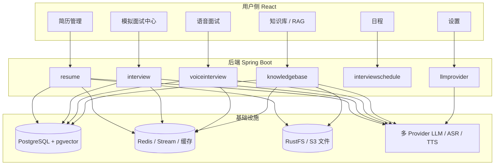
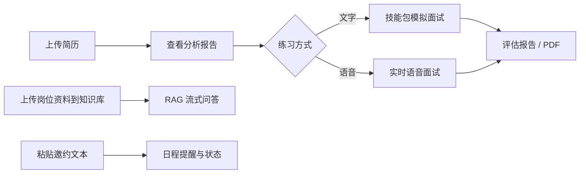
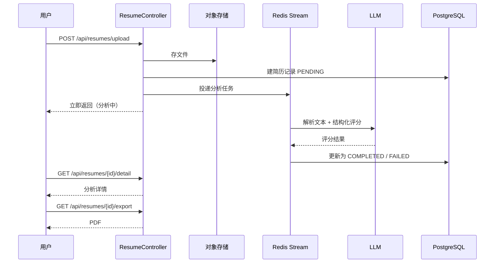
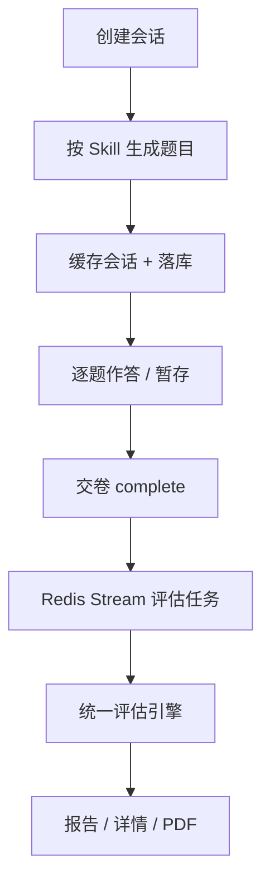
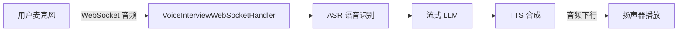
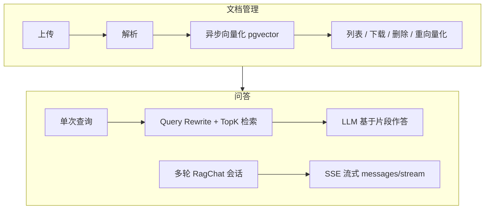
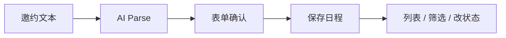
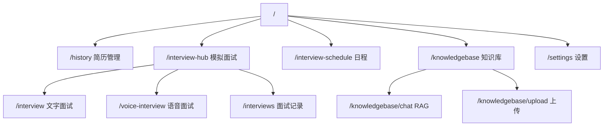

# 02 · 项目各模块全功能概览

> 项目：`ai-interview-platform`（仓库 [interview-guide](https://github.com/Snailclimb/interview-guide) 学习型 fork）  
> 定位：**AI 全栈应用**——简历分析、文字/语音模拟问答、知识库 RAG 问答、日程管理，以及可配置的多模型服务。  
> 技术栈概览：Spring Boot 4.1 + Java 21 + Spring AI 2.0 + PostgreSQL/pgvector + Redis + React 18 / TypeScript / Vite  
> 上一篇：[01 本地启动](01-env-setup.md)；下一篇：[03 库表设计](03-db-schema-design.md)。

---

## 1. 总体功能一览

平台围绕「准备 → 练习 → 沉淀知识 → 管理日程」形成闭环：

| 能力域 | 用户能做什么 | 主入口（前端） | 后端模块 |
|--------|--------------|----------------|----------|
| 简历分析 | 上传简历，获得结构化评分与报告，可导出 PDF | `/upload`、`/history` | `resume` |
| 文字模拟面试 | 按技能包/难度出题作答，交卷后异步评估与报告 | `/interview-hub`、`/interview`、`/interviews` | `interview` |
| 实时语音面试 | 麦克风实时对话（ASR→LLM→TTS），结束后评估 | `/voice-interview` | `voiceinterview` |
| 知识库 & RAG | 上传文档向量化；单次检索或流式多轮问答 | `/knowledgebase*`、`/knowledgebase/chat` | `knowledgebase` |
| 面试日程 | 解析邀约文本、维护日程与状态 | `/interview-schedule` | `interviewschedule` |
| 模型与语音配置 | 配置 Chat/Embedding/ASR/TTS Provider | `/settings` | `llmprovider` |

### 1.1 产品全景图

### 1.2 典型用户旅程

### 1.3 横切能力（支撑所有业务）

| 能力 | 说明 |
|------|------|
| 多 LLM Provider | 设置页配置；业务经 `LlmProviderRegistry` 统一调用 |
| Redis Stream 异步 | 简历分析、文字/语音评估、知识库向量化后台执行，前端可感知「处理中」 |
| 限流 | `@RateLimit`（全局/IP/会话等）保护昂贵 AI 接口 |
| SSE 流式输出 | 知识库查询与 RAG 多轮对话逐字返回 |
| WebSocket | 语音面试全双工音视频/控制链路 |
| 统一响应 | `Result<T>` + 业务错误码；API 文档见 `/swagger-ui.html` |
| 对象存储 + 文档解析 | RustFS/S3 + Apache Tika，支持 PDF/DOCX 等 |
| PDF 导出 | 简历分析报告、面试报告导出 |

---

## 2. 模块详解

### 2.1 简历管理（`resume`）

**目标：** 把简历文件变成可阅读的 AI 分析结果，并支持历史管理与导出。

**前端页面**

| 路由 | 页面 | 作用 |
|------|------|------|
| `/upload` | 上传页 | 选择文件并上传 |
| `/history` | 简历列表 | 查看所有简历及分析状态 |
| `/history/:resumeId` | 详情页 | 查看评分、维度反馈等 |

**核心流程**

**主要能力**

- 上传：PDF / DOCX / DOC / TXT / MD 等（业务层还可再限简历类型）
- 异步 AI 分析与评分（结构化输出）
- 列表 / 详情 / 删除
- 重新分析（限流更严）
- 导出分析报告 PDF
- API 前缀：`/api/resumes`

---

### 2.2 文字模拟面试（`interview`）

**目标：** 基于技能包（及可选简历/JD）生成题目，完成一轮文字问答与评估。

**前端页面**

| 路由 | 作用 |
|------|------|
| `/interview-hub` | 选择文字/语音、技能、难度、是否关联简历 |
| `/interview`、`/interview/:resumeId` | 答题进行中 |
| `/interviews`、`/interviews/:sessionId` | 历史列表与单场详情 |

**技能包：** 后端 `resources/skills/` 预置多套主题（如 Java 后端、前端、算法、系统设计等）；支持按 JD 解析考察维度（`POST /api/interview/skills/parse-jd`）。

**核心流程**

**主要能力**

- 会话：创建、列表、删除；按简历查未完成会话
- 交互：取当前题、提交答案、暂存答案、提前交卷
- 结果：报告、详情、PDF 导出
- 技能：列表、详情、JD 维度解析
- API：`/api/interview/sessions`、`/api/interview/skills`
- 评估异步：`EvaluateStreamProducer/Consumer`

---

### 2.3 实时语音面试（`voiceinterview`）

**目标：** 低延迟的口语模拟面试——听得懂、答得上、说得出。

**前端页面**

| 路由 | 作用 |
|------|------|
| `/voice-interview` | 进行中：录音、播放、字幕/状态 |
| `/voice-interview/:sessionId/evaluation` | 评估结果 |

**实时链路（产品核心）**

**主要能力**

- REST：创建/查询/结束/暂停/恢复会话；列表与删除；消息历史
- 触发并查询异步评估
- WebSocket：`/ws/voice-interview/{sessionId}`（ASR → LLM → TTS 级联；含 VAD 断句、开场白缓存等优化）
- API 前缀：`/api/voice-interview`
- 评估异步：`VoiceEvaluateStream*`

---

### 2.4 知识库与 RAG 问答（`knowledgebase`）

**目标：** 把岗位/项目文档变成可检索知识，用自然语言问到「有依据」的回答。

**前端页面**

| 路由 | 作用 |
|------|------|
| `/knowledgebase` | 文档列表、分类、状态 |
| `/knowledgebase/upload` | 上传待向量化文档 |
| `/knowledgebase/chat` | RAG 助手（流式多轮） |

**两条能力线**

**主要能力 — 文档**

- 上传 → 异步向量化；列表、详情、删除、下载
- 分类、搜索、统计；失败可重新向量化
- API：`/api/knowledgebase`（含 `/query`、`/query/stream`）

**主要能力 — 多轮 RAG 聊天**

- 会话 CRUD、改标题、置顶、绑定知识库
- 流式发消息：`POST /api/rag-chat/sessions/{sessionId}/messages/stream`
- API：`/api/rag-chat`

---

### 2.5 面试日程（`interviewschedule`）

**目标：** 把零散邀约整理成可维护的日程，减少漏约。

**前端页面：** `/interview-schedule`

**主要能力**

- `POST /api/interview-schedule/parse`：AI 解析邀约原文 → 公司、岗位、时间、类型等结构化字段
- 日程 CRUD；按时间范围或状态筛选列表
- 更新状态（如 PENDING / COMPLETED / CANCELLED / RESCHEDULED）
- 定时逻辑可把过期 PENDING 等状态批量推进（`ScheduleStatusUpdater`）

---

### 2.6 模型与语音服务配置（`llmprovider`）

**目标：** 不改代码即可切换 Chat / Embedding / ASR / TTS 服务商与密钥。

**前端页面：** `/settings`

**主要能力**

- Provider CRUD、连通性测试、配置热重载
- 默认 Chat Provider / Embedding Provider
- ASR、TTS 配置读写；ASR 测试
- API Key 加密存储
- API 前缀：`/api/llm-provider`

业务模块统一通过 `LlmProviderRegistry` 取 `ChatClient`，避免各处硬编码厂商 SDK。

---

## 3. 前端信息架构

侧栏对应的主要导航（见 `frontend/src/components/Layout.tsx` 与 `App.tsx`）：

默认 `/` 重定向到 `/history`。

---

## 4. 异步任务总览

耗时 AI / 向量化任务不堵在 HTTP 请求线程里，而走 Redis Stream：

| 任务 | Stream 用途 | 用户感知 |
|------|-------------|----------|
| 简历分析 | `resume:analyze:*` | 上传后「分析中」→ 详情可看结果 |
| 文字面试评估 | `interview:evaluate:*` | 交卷后出报告 |
| 语音面试评估 | `voice:evaluate:*` | 结束后出评估 |
| 知识库向量化 | `knowledgebase:vectorize:*` | 文档状态 PENDING → 可检索 |

公共模板：`AbstractStreamProducer` / `AbstractStreamConsumer`（ACK、重试、失败态、实体已删则丢弃）。

---

## 5. 技术组件与功能的对应关系

| 用户功能 | 关键技术 |
|----------|----------|
| 简历/知识库上传 | S3 兼容存储、Tika 解析、文件哈希去重 |
| 各类 AI 评分与出题 | Spring AI、`StructuredOutputInvoker`、Prompt 模板 |
| 知识库问答 | pgvector、Embedding、Query Rewrite、SSE |
| 语音面试 | WebSocket、通义 ASR/TTS、流式 LLM |
| 「处理中」状态 | Redis Stream + DB 任务状态字段 |
| 防刷 | Redisson + Lua 限流切面 |
| 报告带走 | iText PDF 导出 |

---

## 6. 开发与体验入口

| 入口 | 说明 |
|------|------|
| 前端开发服 | 通常 `http://localhost:5173`（Vite） |
| 后端 API | 默认见 `application.yml` 中 `server.port`（如 8082） |
| Swagger | `http://localhost:<port>/swagger-ui.html` |
| OpenAPI | `/v3/api-docs` |
| 本地依赖 | `docker-compose.dev.yml`：PostgreSQL(+pgvector)、Redis、RustFS |

---

## 7. 模块 ↔ 源码速查

| 模块 | 后端包 | 前端主要页面 |
|------|--------|--------------|
| 简历 | `modules/resume` | `UploadPage`、`HistoryPage`、`ResumeDetailPage` |
| 文字面试 | `modules/interview` | `InterviewHubPage`、`InterviewPage`、`InterviewHistoryPage` |
| 语音面试 | `modules/voiceinterview` | `VoiceInterviewPage`、`VoiceInterviewEvaluationPage` |
| 知识库/RAG | `modules/knowledgebase` | `KnowledgeBaseManagePage`、`KnowledgeBaseUploadPage`、`KnowledgeBaseQueryPage` |
| 日程 | `modules/interviewschedule` | `InterviewSchedulePage` |
| 模型配置 | `modules/llmprovider` | `SettingsPage` |

本文专注**产品功能说明**；各模块背后的技术要点见 [按业务模块](modules/README.md) 与 [按核心技术问答](tech-qa/README.md)，索引见 [笔记总览](../README.md)。
