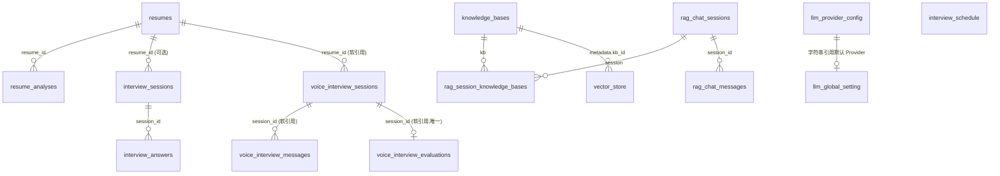
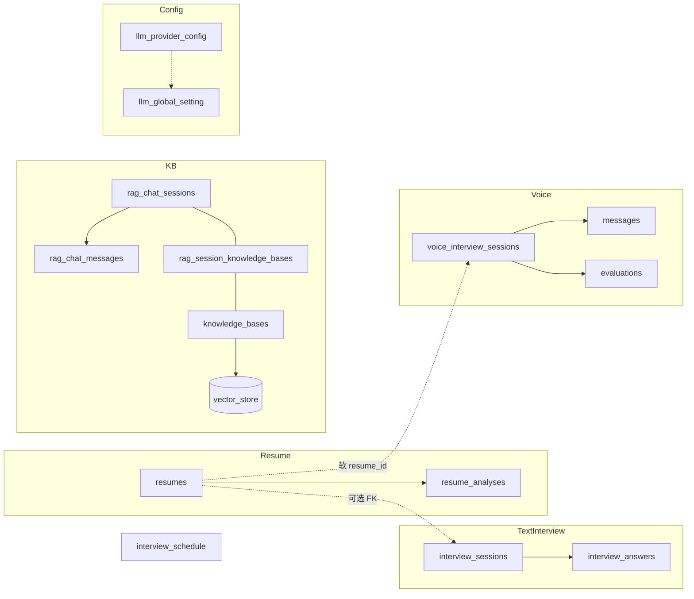

# 03 · 数据库库表设计与模块逻辑

> 基于 JPA Entity + Spring AI PgVectorStore 梳理（开发环境 `ddl-auto=update` / `initialize-schema=true` 自动建表）。  
> 实体包根路径：`app/src/main/java/interview/guide/modules/`  
> 上一篇：[02 功能全景](02-project-features-overview.md)；持久化踩坑见 [05 JPA 实操](05-jpa-persistence.md)。

---

## 0. 总览

### 0.1 表清单

| 模块 | 表名 | Entity | 说明 |
|------|------|--------|------|
| resume | `resumes` | `ResumeEntity` | 简历文件元数据 + 解析文本 + 分析任务状态 |
| resume | `resume_analyses` | `ResumeAnalysisEntity` | 简历评分结果（可多条，取最新） |
| interview | `interview_sessions` | `InterviewSessionEntity` | 文字模拟面试会话 |
| interview | `interview_answers` | `InterviewAnswerEntity` | 逐题作答与评估 |
| voiceinterview | `voice_interview_sessions` | `VoiceInterviewSessionEntity` | 语音面试会话 |
| voiceinterview | `voice_interview_messages` | `VoiceInterviewMessageEntity` | 语音对话消息日志 |
| voiceinterview | `voice_interview_evaluations` | `VoiceInterviewEvaluationEntity` | 语音面试总评（1:1） |
| knowledgebase | `knowledge_bases` | `KnowledgeBaseEntity` | 知识库文档元数据 + 向量化状态 |
| knowledgebase | `rag_chat_sessions` | `RagChatSessionEntity` | RAG 多轮会话 |
| knowledgebase | `rag_chat_messages` | `RagChatMessageEntity` | RAG 消息 |
| knowledgebase | `rag_session_knowledge_bases` | （JoinTable） | 会话 ↔ 知识库 多对多 |
| knowledgebase | `vector_store` | （非 JPA，Spring AI） | pgvector 分块向量 |
| interviewschedule | `interview_schedule` | `InterviewScheduleEntity` | 面试日程 |
| llmprovider | `llm_provider_config` | `LlmProviderEntity` | LLM Provider 配置（含加密 API Key） |
| llmprovider | `llm_global_setting` | `LlmGlobalSettingEntity` | 全局默认 Chat / Embedding Provider（单例） |

**不在库表中：** ASR / TTS 配置写在 YAML（`app.voice-interview.qwen.*`），经设置页改写运行时属性与本地 YAML，无对应 Entity。

### 0.2 ER 关系（逻辑）

说明：

- **硬 FK（JPA）**：`resume_analyses`、`interview_sessions`→`resumes`、`interview_answers`、`rag_chat_messages`、RAG 中间表。
- **软引用（仅 Long/String 列）**：语音模块 `session_id` / `resume_id`；`llm_global_setting` 的 provider id。由应用层维护一致性。

### 0.3 共用异步状态

| 枚举 | 值 | 使用处 |
|------|-----|--------|
| `AsyncTaskStatus` | `PENDING` → `PROCESSING` → `COMPLETED` / `FAILED` | 简历分析、文字/语音评估 |
| `VectorStatus` | 同上语义 | 知识库向量化 |

---

## 1. 简历模块（`resume`）

**业务：** 上传 PDF/DOCX → RustFS 存原件 → Tika 抽文本 → Redis Stream 异步 LLM 评分 → 可查看历史 / 导出 PDF / 再分析。

**主服务：** `ResumeUploadService`、`ResumePersistenceService`、`ResumeGradingService`、`ResumeDeleteService`；消费者 `AnalyzeStreamConsumer`。

### 1.1 `resumes`

| 字段 | 类型（逻辑） | 约束 | 含义 |
|------|--------------|------|------|
| `id` | Long | PK，自增 | |
| `file_hash` | String(64) | NOT NULL，**唯一** | 文件 SHA-256，去重键 |
| `original_filename` | String | NOT NULL | 原始文件名 |
| `file_size` | Long | | 字节数 |
| `content_type` | String | | MIME |
| `storage_key` | String(500) | | 对象存储 Key |
| `storage_url` | String(1000) | | 访问 URL |
| `resume_text` | TEXT | | 解析后的纯文本 |
| `uploaded_at` | DateTime | NOT NULL | `@PrePersist` 写入 |
| `last_accessed_at` | DateTime | | 访问时更新 |
| `access_count` | Integer | 默认 0 | 命中去重也会 +1 |
| `analyze_status` | Enum STRING(20) | 默认 `PENDING` | 分析任务状态 |
| `analyze_error` | String(500) | | 失败原因 |

**索引：** `idx_resume_hash`（`fileHash` unique）。

**逻辑要点：**

1. 同 hash 视为同一简历：直接复用，不重复存文件。
2. 新上传：`analyze_status=PENDING`，入队分析；完成后写 `resume_analyses` 并将状态置 `COMPLETED`。
3. 删除：清理 S3 + 关联文字面试会话（应用编排）；**不会**级联删语音会话。

### 1.2 `resume_analyses`

| 字段 | 类型 | 约束 | 含义 |
|------|------|------|------|
| `id` | Long | PK | |
| `resume_id` | FK → `resumes` | NOT NULL，`@ManyToOne` LAZY | 所属简历 |
| `overall_score` | Integer | | 总分 0–100 |
| `content_score` | Integer | | 内容完整性 0–25 |
| `structure_score` | Integer | | 结构清晰度 0–20 |
| `skill_match_score` | Integer | | 技能匹配 0–25 |
| `expression_score` | Integer | | 表达专业性 0–15 |
| `project_score` | Integer | | 项目经验 0–15 |
| `summary` | TEXT | | 摘要 |
| `strengths_json` | TEXT | | 优点列表 JSON |
| `suggestions_json` | TEXT | | 改进建议 JSON |
| `analyzed_at` | DateTime | NOT NULL | 评测时间 |

**逻辑要点：** 同一简历可有多条分析记录（再分析追加）；列表/详情一般取 `analyzed_at` 最新一条。

---

## 2. 文字模拟面试（`interview`）

**业务：** 选技能包 / 难度 / 可选简历 → LLM 出题 → 逐题作答落库 → 交卷后 Redis Stream 异步总评 → 会话状态到 `EVALUATED`。

**主服务：** `InterviewSessionService`、`InterviewPersistenceService`、`AnswerEvaluationService`；`EvaluateStreamProducer` / `EvaluateStreamConsumer`。

### 2.1 `interview_sessions`

| 字段 | 类型 | 约束 | 含义 |
|------|------|------|------|
| `id` | Long | PK | |
| `session_id` | String(36) | NOT NULL，**唯一** | 对外 UUID |
| `skill_id` | String(64) | 默认 `java-backend` | 技能包 |
| `difficulty` | String(16) | 默认 `mid` | `junior` / `mid` / `senior` |
| `resume_id` | Long / FK | **可选** | 关联简历；另有只读列映射避免多余加载 |
| `total_questions` | Integer | | 题目数 |
| `current_question_index` | Integer | 默认 0 | 当前题号 |
| `status` | Enum | 默认 `CREATED` | 见下表 |
| `questions_json` | TEXT | | 题目列表 JSON |
| `overall_score` | Integer | | 总评分数 |
| `overall_feedback` | TEXT | | 总评文字 |
| `strengths_json` | TEXT | | 优势 JSON |
| `improvements_json` | TEXT | | 改进 JSON |
| `reference_answers_json` | TEXT | | 参考答案汇总 JSON |
| `created_at` | DateTime | NOT NULL | |
| `completed_at` | DateTime | | 作答结束时间 |
| `evaluate_status` | AsyncTaskStatus | | 异步评估状态 |
| `evaluate_error` | String(500) | | |
| `llm_provider` | String(50) | 默认 `dashscope` | 出题/评估所用 Provider |

**会话状态 `SessionStatus`：**

| 值 | 含义 |
|----|------|
| `CREATED` | 已创建、尚未开始作答 |
| `IN_PROGRESS` | 作答中 |
| `COMPLETED` | 题目答完 / 已交卷，待或正在评估 |
| `EVALUATED` | 报告已写入 |

**索引：** `(resume_id, created_at)`、`(resume_id, status, created_at)`、`(skillId, createdAt)`。

### 2.2 `interview_answers`

| 字段 | 类型 | 约束 | 含义 |
|------|------|------|------|
| `id` | Long | PK | |
| `session_id` | FK → sessions | NOT NULL | 所属会话；会话 `cascade ALL` + orphanRemoval |
| `question_index` | Integer | 与 session **唯一** | 题号 |
| `question` | TEXT | | 题干 |
| `category` | String | | 题目类别 |
| `user_answer` | TEXT | | 用户答案 |
| `score` | Integer | | 0–100；交卷前常为占位 0，报告生成时回填 |
| `feedback` | TEXT | | 单题反馈 |
| `reference_answer` | TEXT | | 参考答案 |
| `key_points_json` | TEXT | | 采分点 JSON |
| `answered_at` | DateTime | NOT NULL | |

**逻辑要点：**

1. 答案按 `(session_id, question_index)` upsert。
2. 最后一题或提前交卷 → `evaluate_status=PENDING` → Stream → 写回总分与各题分数 → `status=EVALUATED`。
3. 活跃会话可有 Redis 缓存，以 DB 为准可回源。

---

## 3. 语音面试（`voiceinterview`）

**业务：** WebSocket 实时 ASR→LLM→TTS；分阶段 INTRO/TECH/PROJECT/HR；结束入队异步评估，结果写入独立评估表。

**主服务：** `VoiceInterviewService`、`VoiceInterviewEvaluationService`；`VoiceEvaluateStreamProducer` / `Consumer`；`VoiceInterviewWebSocketHandler`。

### 3.1 `voice_interview_sessions`

| 字段 | 类型 | 约束 | 含义 |
|------|------|------|------|
| `id` | Long | PK | 会话主键（消息/评估用此 id） |
| `user_id` | String | | 用户标识（可选） |
| `role_type` | String | NOT NULL | 面试官角色类型 |
| `skill_id` | String(64) | 默认 `java-backend` | |
| `difficulty` | String(16) | 默认 `mid` | |
| `custom_jd_text` | TEXT | | 自定义 JD |
| `resume_id` | Long | **软引用** | 无 JPA `@ManyToOne` |
| `intro_enabled` 等 | Boolean | 默认 true | 阶段开关：intro / tech / project / hr |
| `llm_provider` | String(50) | 默认 `dashscope` | |
| `current_phase` | Enum | | `INTRO`/`TECH`/`PROJECT`/`HR`/`COMPLETED` |
| `status` | Enum | 默认 `IN_PROGRESS` | 见下表 |
| `planned_duration` | Integer | 默认 30 | 计划分钟数 |
| `actual_duration` | Integer | | 实际时长 |
| `start_time` / `end_time` | DateTime | | |
| `created_at` / `updated_at` | DateTime | | |
| `paused_at` / `resumed_at` | DateTime | | 暂停/恢复 |
| `evaluate_status` | AsyncTaskStatus | | 结束后异步评估 |
| `evaluate_error` | String(500) | | |

**会话状态：** `IN_PROGRESS` ↔ `PAUSED` → `COMPLETED`；另有 `FAILED`。

### 3.2 `voice_interview_messages`

| 字段 | 类型 | 含义 |
|------|------|------|
| `id` | Long PK | |
| `session_id` | Long（软） | 指向 sessions.id |
| `message_type` | String | `USER_SPEECH` / `AI_SPEECH` / `SYSTEM` |
| `phase` | Enum | 所属阶段 |
| `user_recognized_text` | TEXT | ASR 文本 |
| `ai_generated_text` | TEXT | LLM 回复 |
| `timestamp` | DateTime | 消息时间 |
| `sequence_num` | Integer | 序号 |
| `created_at` | DateTime | |

### 3.3 `voice_interview_evaluations`

| 字段 | 类型 | 含义 |
|------|------|------|
| `id` | Long PK | |
| `session_id` | Long，**唯一** | 一对一评估 |
| `overall_score` | Integer | |
| `overall_feedback` | TEXT | |
| `question_evaluations_json` | TEXT | 逐题评估（对齐文字面试结构） |
| `strengths_json` / `improvements_json` / `reference_answers_json` | TEXT | |
| `interviewer_role` | String | |
| `interview_date` | DateTime | |
| `created_at` | DateTime | |

**逻辑要点：** 无对话内容时也可生成空报告（分 0）；断线可触发进行中会话结束；与简历删除无硬级联。

---

## 4. 知识库与 RAG（`knowledgebase`）

**业务：** 文档上传去重 → 异步切块 Embedding 写入 `vector_store` → 单次检索或 RAG 多轮（可绑多个已向量化知识库）。

**主服务：** `KnowledgeBaseUploadService`、`KnowledgeBaseVectorService`、`KnowledgeBaseDeleteService`、`RagChatSessionService`、`KnowledgeBaseQueryService`；`VectorizeStream*`；`VectorRepository`。

### 4.1 `knowledge_bases`

| 字段 | 类型 | 约束 | 含义 |
|------|------|------|------|
| `id` | Long | PK | |
| `file_hash` | String(64) | **唯一** | 去重 |
| `name` | String | NOT NULL | 展示名 |
| `category` | String(100) | 有索引 | 分类 |
| `original_filename` | String | NOT NULL | |
| `file_size` / `content_type` | | | |
| `storage_key` / `storage_url` | | | 对象存储 |
| `uploaded_at` / `last_accessed_at` | DateTime | | |
| `access_count` | Integer | | |
| `question_count` | Integer | | 被提问次数 |
| `vector_status` | VectorStatus | 默认 `PENDING` | 向量化状态 |
| `vector_error` | String(500) | | |
| `chunk_count` | Integer | 默认 0 | 分块数（字段已有；当前代码路径未必回写） |

### 4.2 `rag_chat_sessions`

| 字段 | 类型 | 含义 |
|------|------|------|
| `id` | Long PK | |
| `title` | String NOT NULL | 标题 |
| `status` | `ACTIVE` / `ARCHIVED` | |
| `created_at` / `updated_at` | DateTime | |
| `message_count` | Integer | 冗余消息数 |
| `is_pinned` | Boolean 默认 false | 置顶 |

多对多：`@JoinTable(name = "rag_session_knowledge_bases")`  
列：`session_id`、`knowledge_base_id`。

### 4.3 `rag_chat_messages`

| 字段 | 类型 | 含义 |
|------|------|------|
| `id` | Long PK | |
| `session_id` | FK NOT NULL | cascade + orphanRemoval |
| `type` | `USER` / `ASSISTANT` | |
| `content` | TEXT NOT NULL | |
| `message_order` | Integer NOT NULL | 排序 |
| `created_at` / `updated_at` | DateTime | 流式可多次更新 |
| `completed` | Boolean 默认 true | 流式是否结束 |

### 4.4 `vector_store`（Spring AI PgVectorStore）

由 `spring.ai.vectorstore.pgvector` 自动建表（`dimensions: 1024`，`COSINE`，`HNSW`）。应用侧约定 **metadata**（JSON）关键键：

| metadata 键 | 用途 |
|-------------|------|
| `kb_id` | 正式归属的知识库 ID（字符串） |
| `kb_id_long` | 可选 Long 形式（兼容删除条件） |
| `kb_vector_job_id` | 向量化任务临时 ID |
| `kb_target_id` | 任务目标 KB（临时阶段） |

**向量化安全写入流程：**

1. 切块 Embedding，先以临时 job 元数据写入。
2. 成功：删旧 `kb_id` 向量 → `promoteVectorJob` 把 job 提升为正式 `kb_id`。
3. 失败：按 `kb_vector_job_id` 清理临时行，KB 标 `FAILED`。

删除知识库：清中间表关联 → JDBC 删 `vector_store` → 删对象存储 → 删 `knowledge_bases` 行。

---

## 5. 面试日程（`interviewschedule`）

**业务：** 手工维护或 LLM 解析邀约文本；状态流转；定时任务将过期仍为 `PENDING` 的日程改为 `CANCELLED`。

**主服务：** `InterviewScheduleService`、`InterviewParseService`、`ScheduleStatusUpdater`（`@Scheduled` 小时级）。

### 5.1 `interview_schedule`

| 字段 | 类型 | 约束 | 含义 |
|------|------|------|------|
| `id` | Long | PK | |
| `company_name` | String | NOT NULL | 公司 |
| `position` | String | NOT NULL | 职位 |
| `interview_time` | DateTime | NOT NULL | 面试时间 |
| `interview_type` | String | | `ONSITE` / `VIDEO` / `PHONE` 等 |
| `meeting_link` | TEXT | | 会议链接 |
| `round_number` | Integer | 默认 1 | 轮次 |
| `interviewer` | String | | 面试官 |
| `notes` | TEXT | | 备注 |
| `status` | Enum NOT NULL | 默认 `PENDING` | `PENDING` / `COMPLETED` / `CANCELLED` / `RESCHEDULED` |
| `created_at` / `updated_at` | DateTime | | |

**无外键**，与其它业务模块独立。

---

## 6. LLM Provider（`llmprovider`）

**业务：** 多 Provider 的 baseUrl / model / embedding；API Key 加密落库；全局默认 Chat 与 Embedding；启动时可从 YAML bootstrap。

**主服务：** `LlmProviderConfigService`、`LlmProviderBootstrapService`、`ApiKeyEncryptionService`；运行时 `LlmProviderRegistry`。

### 6.1 `llm_provider_config`

| 字段 | 类型 | 约束 | 含义 |
|------|------|------|------|
| `id` | String(64) | PK | 如 `dashscope`、`openai` |
| `base_url` | String(512) | NOT NULL | |
| `api_key_ciphertext` | String(4096) | NOT NULL | 密文 |
| `api_key_nonce` | String(64) | NOT NULL | 加密 nonce |
| `model` | String(128) | NOT NULL | Chat 模型名 |
| `embedding_model` | String(128) | | Embedding 模型 |
| `embedding_dimensions` | Integer | | 维度（项目约定 1024） |
| `supports_embedding` | boolean | NOT NULL | |
| `temperature` | Double | | |
| `enabled` | boolean | NOT NULL | |
| `builtin` | boolean | NOT NULL | 内置不可随意删 |
| `created_at` / `updated_at` | DateTime | NOT NULL | |

### 6.2 `llm_global_setting`

| 字段 | 类型 | 含义 |
|------|------|------|
| `id` | Long | **固定 `1`** 单例 |
| `default_chat_provider_id` | String(64) | 逻辑指向 `llm_provider_config.id` |
| `default_embedding_provider_id` | String(64) | 同上 |
| `created_at` / `updated_at` | DateTime | |

无 DB 级 FK；写入时由 Service 校验 Provider 存在且启用。

---

## 7. 跨模块数据流（简图）

| 异步 Stream（Redis） | 写回的表 / 字段 |
|----------------------|-----------------|
| 简历分析 | `resume_analyses` + `resumes.analyze_status` |
| 文字评估 | `interview_answers` 分数反馈 + `interview_sessions` 总评字段 / `evaluate_status` |
| 语音评估 | `voice_interview_evaluations` + session `evaluate_status` |
| 知识库向量化 | `vector_store` + `knowledge_bases.vector_status` |

---

## 8. 设计备忘

1. **结构化列表多用 JSON TEXT**（优点、题目、参考答案等），避免额外子表，读写靠应用序列化。
2. **异步状态与业务状态分离**：如会话 `COMPLETED` 与 `evaluate_status=PROCESSING` 可并存。
3. **语音表软引用**：灵活但删简历时不会自动清语音数据，需知悉。
4. **向量表非业务 Entity**：用 Spring AI + 少量 JDBC 维护 metadata 生命周期。
5. **敏感配置**：Provider Key 进库加密；ASR/TTS 仍走 YAML/环境变量。

---

*文档对应代码版本以仓库当前 Entity 为准；若改表结构，请同步更新本文件。*
