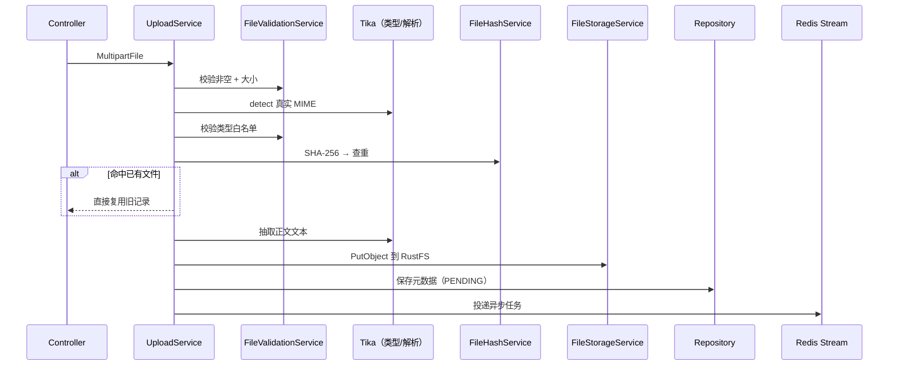

# 07 · 对象存储与文档解析（RustFS/S3 + Tika）

> 对应源码：`infrastructure/file/`（`FileStorageService`、`FileValidationService`、`FileHashService`、`ContentTypeDetectionService`、`DocumentParseService`、`TextCleaningService`）、`common/config/S3Config`、`common/config/StorageConfigProperties`、`infrastructure/export/PdfExportService`  
> 上游依赖：本地 `docker-compose.dev.yml` 起的 **RustFS**（S3 兼容），见 [01 本地启动](01-env-setup.md)

简历和知识库都是「上传一个文件 → 变成能被 AI 用的文本」。这条链路里其实有六件事：**校验、嗅探类型、算哈希去重、抽文本、存对象存储、落库**。这篇把它们拆开看。

---

## 1. 上传全链路



两条业务线的差异：

| | 简历 `ResumeUploadService` | 知识库 `KnowledgeBaseUploadService` |
|--|---------------------------|-------------------------------------|
| 大小上限（业务层） | 10MB | 50MB |
| 类型白名单 | `app.resume.allowed-types`（PDF / DOC / DOCX / TXT） | MIME 列表 **或** `.md` / `.markdown` 扩展名 |
| 存储前缀 | `resumes/` | `knowledgebases/` |
| 后续异步任务 | 分析评分 | 切块向量化 |

Servlet 层还有一道总闸：`spring.servlet.multipart.max-file-size: 50MB`。超过它在进 Controller 前就被拦下，由 `GlobalExceptionHandler` 转成统一 `Result`。**三层限制（Servlet 50MB → 业务 10/50MB）要一起看**，只改业务常量不改 Servlet 会白改。

---

## 2. S3 客户端：为什么必须 path-style

`S3Config` 用 AWS SDK v2 连本地 RustFS：

```30:37:app/src/main/java/interview/guide/common/config/S3Config.java
        return S3Client.builder()
            .endpointOverride(URI.create(storageConfig.getEndpoint()))
            .region(Region.of(storageConfig.getRegion()))
            .credentialsProvider(StaticCredentialsProvider.create(credentials))
            .overrideConfiguration(clientOverrideConfiguration())
            // 使用路径风格访问，避免 SDK 使用 bucket.endpoint 导致 DNS 解析失败。
            .forcePathStyle(true)
            .build();
```

| 访问风格 | URL 形态 | 适用 |
|----------|----------|------|
| Virtual-host（SDK 默认） | `https://<bucket>.s3.amazonaws.com/<key>` | 真·AWS S3 |
| **Path-style**（本项目） | `http://localhost:9000/<bucket>/<key>` | RustFS / MinIO 等本地兼容实现 |

不开 `forcePathStyle`，SDK 会去解析 `interview-guide.localhost` 这种域名，本地必然失败。**这是接 S3 兼容存储时最常见的第一个坑。**

另外两处配置：`endpointOverride` 指向本地 9000；`apiCallTimeout` / `apiCallAttemptTimeout` 限制整体与单次尝试超时，避免存储卡住时请求线程一直挂着。

---

## 3. 桶自举与对象 Key 设计

启动时 `@PostConstruct` 检查桶是否存在，不存在就建（可用 `app.storage.auto-create-bucket` 关掉）：

```text
HeadBucket → 404 / NoSuchBucket → CreateBucket
CreateBucket 撞上 409 → 视为「别的进程已建好」，不报错
```

对象 Key 由 `generateFileKey` 生成：

```text
{prefix}/{yyyy/MM/dd}/{8位UUID}_{安全文件名}
resumes/2026/07/31/a1b2c3d4_ZhangSanJianLi.pdf
```

三个设计点：

1. **日期分层**：避免所有对象堆在一个前缀下，也方便按天排查。
2. **UUID 前缀**：同名文件不互相覆盖。
3. **文件名净化**：汉字经 pinyin4j 转大驼峰拼音，其余非 `[A-Za-z0-9._-]` 字符统一变 `_`。中文/空格/特殊符号直接进 Key 容易在不同 S3 实现和 URL 编码上踩坑。

`getFileUrl()` 只是把 `endpoint/bucket/key` 拼成字符串，**不是签名 URL**——桶若不公开可读，这个地址不能直接给浏览器用。要做私有访问得另加预签名或后端代理下载（当前走 `downloadFile` 后端中转）。

---

## 4. 类型嗅探与哈希去重

### 4.1 别信浏览器传的 Content-Type

`ContentTypeDetectionService` 用 Tika 按**文件内容**嗅探真实 MIME，校验白名单时用的是它，而不是 `MultipartFile.getContentType()`（那个来自请求头，可以伪造）。

需要留意的现状：上传到 S3 时 `PutObjectRequest.contentType(file.getContentType())` 用的仍是请求头值——**校验用嗅探结果，存储元数据用客户端值**，二者可能不一致。

### 4.2 SHA-256 去重

`FileHashService` 对文件字节算 SHA-256，`resumes.file_hash` / `knowledge_bases.file_hash` 都是唯一索引（见 [03 库表设计](03-db-schema-design.md)）。命中已有哈希就直接复用旧记录，不重复存储、不重复调 AI。

代价与边界：

- 简历链路里查重和落库各算了一次哈希，等于**读两遍文件字节**；
- 去重是「字节完全一致」级别，同一份简历改一个字就是新文件；
- 简历侧查重方法把异常吞成「没查到」，哈希异常时会退化为不去重。

---

## 5. Tika 抽文本：只要正文

`DocumentParseService.parseContent` 的关键配置：

| 配置 | 作用 |
|------|------|
| `AutoDetectParser` | 按内容自动选解析器，不靠扩展名 |
| `BodyContentHandler(5MB)` | 只取正文，并给提取文本设上限 |
| `NoOpEmbeddedDocumentExtractor` | **不解析**嵌入图片/附件 |
| `PDFParserConfig.setExtractInlineImages(false)` | 不抽内嵌图片 |
| `PDFParserConfig.setSortByPosition(true)` | 按坐标排序，改善多栏 PDF 的阅读顺序 |

不禁嵌入资源时，PDF 解析结果里常混进图片占位和 `file:/...` 临时路径，直接喂给 LLM 就是噪声。除了上面两道，`TextCleaningService` 还会再清一遍图片标记、`file:` URL 和控制字符。

注意 **50MB 文件 vs 5MB 文本**：允许上传的是原始文件大小，Tika 抽出的正文超过 5MB 会被截断。文字密集的大文档要意识到这条线。

---

## 6. 导出：iText 8

`infrastructure/export/PdfExportService` 负责把库里的结果渲染成 PDF：

| 方法 | 导出内容 |
|------|----------|
| `exportResumeAnalysis` | 简历分析报告：总分、各维度、摘要、优点、建议 |
| `exportInterviewReport` | 模拟问答报告：会话信息、总评、逐题详情 |

中文能正常显示的关键是**内嵌字体 + `IDENTITY_H` 编码**（`fonts/ZhuqueFangsong-Regular.ttf`）；用默认字体导中文会直接乱码或丢字。另有 `sanitizeText` 过滤 emoji 等字体不支持的字符。

导出是纯读库 + 内存生成字节流，和上传链路无关。

---

## 7. 我踩过 / 需要留意的点

| 现象 | 根因 | 处理 |
|------|------|------|
| 本地上传报 500，S3 请求被拦 | 系统 HTTP 代理把 `localhost:9000` 也代理走了 | `NO_PROXY=localhost,127.0.0.1,::1`（见 [01](01-env-setup.md)） |
| SDK 解析 `bucket.localhost` 失败 | 未开 path-style | `forcePathStyle(true)` |
| 上传大文件 413 / 报大小超限 | Servlet 层 50MB 闸门 | 同时调 `spring.servlet.multipart.*` 与业务常量 |
| PDF 解析出一堆 `file:/...` | Tika 解析了嵌入资源 | 禁 `EmbeddedDocumentExtractor` + `TextCleaningService` |
| 库里 `content_type` 与实际不符 | 存的是请求头值 | 需要严格时改存 Tika 嗅探结果 |
| 存储里有孤儿对象 | 先传 S3 后落库，落库失败没有补偿删除 | 目前靠日志；可加清理任务 |
| 删除记录后文件还在 | 删除路径里 S3 失败只记日志，不回滚 | 有意为之（DB 一致优先），但需要巡检 |

---

## 8. 配置速查

| 配置键 | 环境变量 | 默认 |
|--------|----------|------|
| `app.storage.endpoint` | `APP_STORAGE_ENDPOINT` | `http://localhost:9000` |
| `app.storage.access-key` / `secret-key` | `APP_STORAGE_ACCESS_KEY` / `_SECRET_KEY` | 必填 |
| `app.storage.bucket` | `APP_STORAGE_BUCKET` | `interview-guide` |
| `app.storage.region` | `APP_STORAGE_REGION` | `us-east-1` |
| `app.storage.auto-create-bucket` | `APP_STORAGE_AUTO_CREATE_BUCKET` | `true` |
| `app.storage.api-call-timeout` | — | `60s` |
| `app.storage.api-call-attempt-timeout` | — | `20s` |
| `spring.servlet.multipart.max-file-size` | — | `50MB` |
| `app.resume.allowed-types` | — | PDF / DOC / DOCX / TXT |

绑定类：`StorageConfigProperties`（`app.storage`）、`AppConfigProperties`（`app.resume`）——符合「配置集中绑定，不在 Service 里散落 `@Value`」的约定（见 [04](04-spring-boot-foundations.md)）。

---

## 核心要点

1. **接 S3 兼容存储先开 path-style**，否则本地必挂在域名解析上。
2. **类型校验靠内容嗅探**，不靠请求头；但要清楚存进库/对象元数据的是哪一个值。
3. **哈希去重省钱**：同一份文件不重复存、不重复调 AI；代价是多读一遍字节。
4. **Tika 要显式关掉嵌入资源解析**，否则文本里全是图片与临时路径噪声。
5. **大小限制是分层的**：Servlet 闸门在业务校验之前。
6. **中文 PDF 导出必须内嵌字体 + IDENTITY_H。**

→ 上传后的异步处理（分析 / 向量化）见 [06 Redis Stream](06-redis-stream-async.md)；向量化细节见 [09 RAG](09-rag-pipeline.md)。
