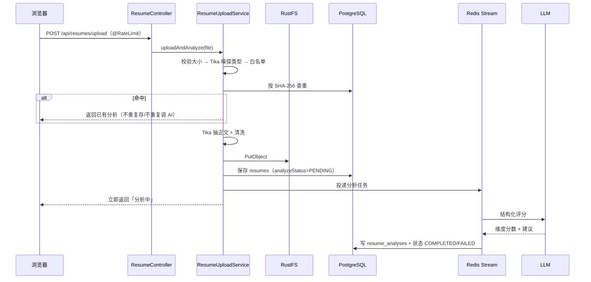

# 模块 01 · 简历分析（`resume`）

> 源码：`modules/resume/`（`ResumeController`、`service/ResumeUploadService`、`ResumeParseService`、`ResumePersistenceService`、`ResumeGradingService`、`ResumeHistoryService`、`ResumeDeleteService`、`listener/AnalyzeStream*`）  
> 表：`resumes`、`resume_analyses`（见 [库表设计 §1](../03-db-schema-design.md)）  
> 前端：`/upload`、`/history`、`/history/:resumeId`；API 前缀 `/api/resumes`

这是全项目**技术面最宽**的一条链路：一次上传里同时出现文件校验、类型嗅探、哈希去重、对象存储、文档解析、异步队列、结构化 LLM 输出、状态回写、PDF 导出。想快速理解整套工程套路，读这个模块最划算。

---

## 1. 一次上传怎么走完



关键点：**HTTP 请求里不调 LLM**。请求线程只做「存 + 落库 + 入队」，评分在消费者里跑。

---

## 2. 模块内的分工

| 类 | 职责 |
|----|------|
| `ResumeController` | 路由 + `@RateLimit` + 包 `Result` |
| `ResumeUploadService` | 编排上传全流程；`reanalyze` 重新入队 |
| `ResumeParseService` | 委托 `ContentTypeDetectionService` / `DocumentParseService`（模块内薄封装） |
| `ResumePersistenceService` | 查重、保存简历与分析结果、状态更新（事务都在这里） |
| `ResumeGradingService` | 调 `StructuredOutputInvoker` + `resume-analysis-*.st` 产出结构化评分 |
| `ResumeHistoryService` | 列表 / 详情 / PDF 导出 |
| `ResumeDeleteService` | 删除：S3 → 关联问答会话 → DB |
| `AnalyzeStreamProducer` / `Consumer` | 异步任务入队与消费 |

分层是标准三层，唯一要注意的是**Persistence 与 Grading 拆开**：一个只碰库（短事务），一个只调 AI（事务外）。

---

## 3. 涉及的核心技术要点

| 技术 | 在这个模块的体现 | 深入 |
|------|------------------|------|
| Servlet 文件上传 | `spring.servlet.multipart` 50MB 总闸 + 业务层 10MB | [tech-qa/09](../tech-qa/09-file-storage-parsing.md) |
| 内容嗅探与白名单 | Tika 探真实 MIME，不信请求头；`app.resume.allowed-types` | 同上 |
| SHA-256 去重 | `file_hash` 唯一索引，命中即复用 | 同上 |
| S3 兼容存储 | `FileStorageService.uploadResume`，Key 按日期+UUID+拼音 | 同上 |
| Tika 文本抽取 | 禁嵌入资源 + `TextCleaningService` 清噪 | 同上 |
| Redis Stream 异步 | `resume:analyze:*`，PENDING→PROCESSING→COMPLETED/FAILED | [tech-qa/03](../tech-qa/03-redis.md) |
| 结构化输出 | `StructuredOutputInvoker` 重试 + 修复提示；指标 `app.ai.structured_output.*` | [tech-qa/11](../tech-qa/11-ai-quality-evaluation.md) |
| Prompt 模板 | `resume-analysis-system.st` / `-user.st`；简历文本走 sanitizer | [tech-qa/05](../tech-qa/05-prompt-engineering.md) |
| 限流 | upload：GLOBAL 5 + IP 5；reanalyze：GLOBAL 2 + IP 2（每秒） | [tech-qa/10](../tech-qa/10-observability-rate-limit.md) |
| PDF 导出 | `PdfExportService.exportResumeAnalysis`（iText 8 + 内嵌中文字体） | [tech-qa/09](../tech-qa/09-file-storage-parsing.md) |
| 事务边界 | 写 PENDING 是短事务；入队失败用 `REQUIRES_NEW` 打 FAILED | [tech-qa/02](../tech-qa/02-jpa-transaction.md) |

---

## 4. 数据落点与状态机

```text
resumes.analyze_status:  PENDING → PROCESSING → COMPLETED
                                            ↘ FAILED
reanalyze() 把状态重置为 PENDING 再入队
```

- 一份简历可有**多条** `resume_analyses`（每次重新分析追加），列表/详情取 `analyzed_at` 最新一条。
- 评分维度是硬编码的分值上限：内容 25 / 结构 20 / 技能匹配 25 / 表达 15 / 项目 15 = 100。
- 数组类字段（优点、建议）以 JSON TEXT 存，不建子表。

---

## 5. 我注意到的坑与取舍

| 点 | 说明 |
|----|------|
| 哈希算两遍 | 查重与落库各算一次 SHA-256，等于读两遍文件字节；小文件无感，大文件是浪费 |
| 去重异常被吞 | 查重方法把异常转成「没查到」，哈希失败时会退化为不去重（多一次存储与 AI 调用） |
| 孤儿对象 | 先传 S3 再落库，落库失败没有补偿删除，存储里可能留下没人引用的文件 |
| 删除只保 DB 一致 | 删除时 S3 失败只记日志、不回滚，DB 记录照删 |
| 大小限制分三层 | Servlet 50MB / 简历 10MB / 知识库 50MB；只改业务常量不改 Servlet 是白改 |
| `content_type` 存的是请求头值 | 校验用嗅探结果，但落库/对象元数据用 `MultipartFile.getContentType()`，两者可能不一致 |
| `app.resume.upload-dir` 是残留 | 绑定了但代码里没用（早期本地磁盘存储的遗留） |

---

## 6. 想动手改的话

1. **合并两次哈希**：把首次计算结果透传给保存方法，去掉重复读字节。
2. **补偿删除**：落库失败时删掉刚上传的对象，或加一个孤儿对象巡检任务。
3. **全链路集成测试**：Testcontainers 起 PG + Redis，Mock S3/LLM，断言 `PENDING → COMPLETED` 与失败分支（对应学习计划 G4）。
