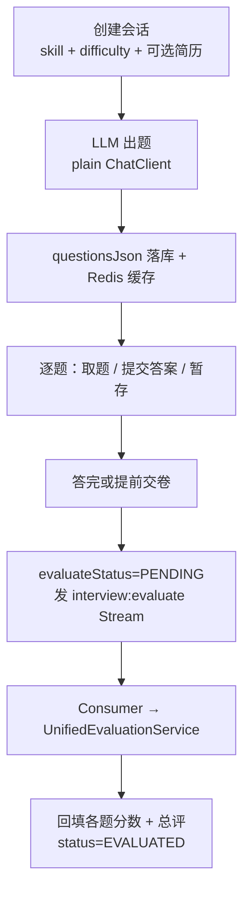

# 模块 02 · 文字模拟问答（`interview`）

> 源码：`modules/interview/`（`InterviewController`、`service/InterviewSessionService`、`InterviewQuestionService`、`InterviewPersistenceService`、`AnswerEvaluationService`、`skill/InterviewSkillService`、`listener/EvaluateStream*`）+ `common/evaluation/UnifiedEvaluationService`  
> 表：`interview_sessions`、`interview_answers`（见 [库表设计 §2](../03-db-schema-design.md)）  
> 前端：`/interview-hub`、`/interview`、`/interviews`；API `/api/interview/sessions`、`/api/interview/skills`

这个模块的看点是**「AI 出题 + 逐题落库 + 交卷后异步评估」三段解耦**，以及技能包（skill pack）如何把静态知识文件变成出题依据。

---

## 1. 主链路

两条状态线并行，别混：

| 线 | 字段 | 取值 |
|----|------|------|
| 业务进度 | `status` | `CREATED` → `IN_PROGRESS` → `COMPLETED` → `EVALUATED` |
| 异步评估 | `evaluate_status` | `PENDING` → `PROCESSING` → `COMPLETED` / `FAILED` |

所以「会话已完成但评估还在跑」是正常中间态，前端据此显示「生成报告中」。

---

## 2. 技能包（skill pack）怎么驱动出题

目录：`app/src/main/resources/skills/{skillId}/`

| 文件 | 作用 |
|------|------|
| `SKILL.md` | YAML front matter（`name`、`description`）+ 正文 persona/指令 |
| `skill.meta.yml` | 展示名与考察分类：`categories[]`（`key`、`label`、`priority`、`ref`、`shared`） |
| `references/*.md` 或 `_shared/references/*.md` | 分类对应的知识参考文件；`shared: true` 走共享目录 |

`InterviewSkillService` 在 `@PostConstruct` 里扫 `classpath:skills/*/SKILL.md`（跳过 `_shared`），解析 front matter + meta，建立 `presetRegistry` 与 `categoryRefIndex`。

出题时（`InterviewQuestionService.generateDirectionOnly`）：

1. `calculateAllocation(categories, questionCount)` 按优先级分配题目数：`ALWAYS_ONE` → `CORE` → `NORMAL`；
2. `buildReferenceSection` 把命中分类的参考 markdown 拼进 prompt 变量；
3. 渲染 `interview-question-skill-system.st` + persona（`SKILL.md` 正文包在 `<data-boundary>` 里）；
4. 走 `StructuredOutputInvoker` 拿 JSON 题目列表。

两个容易忽略的细节：

- 出题用的是 **`getPlainChatClient`**（不挂工具、只留 SafeGuard），prompt 里还明确写了「不要调用工具」——出题要稳定 JSON，不需要 Agent 行为。
- JD 解析（`POST /api/interview/skills/parse-jd`）反过来：把岗位描述文本交给 LLM，输出分类列表，再通过 `categoryRefIndex` 映射回参考文件，拼出一个「自定义 skill」。

---

## 3. 涉及的核心技术要点

| 技术 | 在这个模块的体现 | 深入 |
|------|------------------|------|
| 结构化输出 + 降级 | 出题走 `StructuredOutputInvoker`；彻底失败时 `generateFallbackQuestions` 兜底 | [tech-qa/11](../tech-qa/11-ai-quality-evaluation.md) |
| Prompt 工程与注入防护 | `.st` 模板 + `PromptSanitizer` + `<data-boundary-xxxx>` 随机边界 | [tech-qa/05](../tech-qa/05-prompt-engineering.md) |
| 技能包 / 工具 | `SkillsTool`（`AgentUtilsConfiguration`）让模型按需加载 SKILL.md；本模块出题选择了不用工具 | [tech-qa/07](../tech-qa/07-tool-calling-agent.md) |
| Redis 缓存 | `InterviewSessionCache` 缓存活跃会话，miss 时回源 DB | [tech-qa/03](../tech-qa/03-redis.md) |
| Redis Stream 异步 | `interview:evaluate:*`，Producer 失败用 `REQUIRES_NEW` 打 FAILED | 同上 |
| 统一评估引擎 | `UnifiedEvaluationService` 分批评估 + 二次汇总，与语音模块共用 | [tech-qa/11](../tech-qa/11-ai-quality-evaluation.md) |
| 事务边界 | LLM 出题在事务外，落库是短事务；同类自调用用 `TransactionalExecutor` | [tech-qa/02](../tech-qa/02-jpa-transaction.md) |
| JPA 约束与投影 | `(session_id, question_index)` 唯一；列表接口仍是 `findAll()`，投影待落地 | 同上 |
| 限流 | 创建会话 GLOBAL 5 + IP 5；提交答案 GLOBAL 10；JD 解析 IP 5 | [tech-qa/10](../tech-qa/10-observability-rate-limit.md) |
| PDF 导出 | `PdfExportService.exportInterviewReport` | [tech-qa/09](../tech-qa/09-file-storage-parsing.md) |

---

## 4. 数据落点要点

- `questionsJson` 整份题目存在会话行上（TEXT），逐题作答再落 `interview_answers`。
- 答案按 `(sessionId, questionIndex)` **upsert**，重复提交同一题不会长出多行。
- 提交答案时 `score` 常写占位 0，**真正分数在报告生成阶段回填**——看库里 score=0 别急着当 bug。
- 简历关联是**可选**的 FK（`resume_id` 可空），支持无简历的通用出题；删除简历时由应用编排删掉关联的文字会话。

---

## 5. 我注意到的坑与取舍

| 点 | 说明 |
|----|------|
| 列表接口读大字段 | `listSessions` 走 `findAll()`，会把 `questionsJson` 等 TEXT 全读进来；改法见 [tech-qa/02](../tech-qa/02-jpa-transaction.md) |
| 缓存与库双写 | 会话状态同时在 Redis 与 DB，改状态时要想清楚以哪边为准（当前以 DB 为准，缓存可重建） |
| 评估失败的可见性 | `evaluate_error` 只留 500 字符；排查要配合日志 |
| 指标 context 标签 | `StructuredOutputInvoker` 的 context 传的是中文（如「方向题」），规整后会塌成 `unknown`，指标里区分不出场景 |
| 分批评估的尺度漂移 | 多批独立打分可能宽严不一，靠二次汇总校准；这是设计取舍而非缺陷 |

---

## 6. 想动手改的话

1. **落地列表投影**：`findAllListItems()` JPQL 构造器投影 + Service/Controller 接线。
2. **修指标标签**：给 `logContext` 传英文 key（如 `question_direction`），让 `app.ai.structured_output.*` 能按场景切分。
3. **给新任务类型走一遍 Stream 模板**：例如「重新生成参考答案」，练 Producer/Consumer + 状态机。
