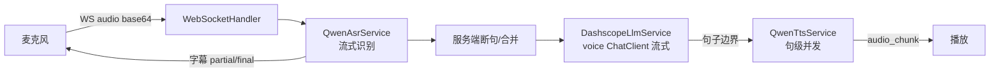

# 模块 03 · 实时语音问答（`voiceinterview`）

> 源码：`modules/voiceinterview/`（`controller/VoiceInterviewController`、`handler/VoiceInterviewWebSocketHandler`、`service/VoiceInterviewService`、`QwenAsrService`、`QwenTtsService`、`DashscopeLlmService`、`VoiceInterviewPromptService`、`config/WebSocketConfig`、`VoiceInterviewProperties`、`listener/VoiceEvaluateStream*`）  
> 表：`voice_interview_sessions`、`voice_interview_messages`、`voice_interview_evaluations`（见 [库表设计 §3](../03-db-schema-design.md)）  
> 前端：`/voice-interview`、`/voice-interview/:sessionId/evaluation`；WebSocket `/ws/voice-interview/{sessionId}`

这是全项目**延迟最敏感**的模块：一次用户说话要跑完 ASR → LLM → TTS 三段，还要边生成边播放。技术看点是流式级联、断句策略和埋点。

---

## 1. 实时链路



三段都在**同一个 WebSocket 会话**里推进：识别中间结果实时回字幕，LLM 一边出 token 一边按句切给 TTS，合成好一句立刻下发播放，不等整段生成完。

---

## 2. 消息协议

上行（JSON，`type` 字段）：

| type | 载荷 | 处理 |
|------|------|------|
| `audio` | `{ data: base64 }` | 送入 ASR |
| `control` | `{ action, data }` | `submit`（可带 `text`）、`end_interview`、`start_phase`（`INTRO`/`TECH`/`PROJECT`/`HR`） |

下行：

| type | 用途 |
|------|------|
| `subtitle` | ASR 中间/最终文本 |
| `text` | LLM 文本流 `{ content, final }` |
| `audio` | 整段 WAV `{ data, text }` |
| `audio_chunk` | 流式 TTS 分片 `{ data, index, isLast }` |
| `control` | 状态，如 `asr_ready`、`audio_complete` |
| `error` | `{ message }` |

前端 `VoiceInterviewWebSocket`（`frontend/src/api/voiceInterview.ts`）用原生 WebSocket，非正常关闭时最多重连 3 次、间隔 2s。

---

## 3. 阶段机与会话状态

```text
阶段：启用的子集里按序推进 INTRO → TECH → PROJECT → HR → COMPLETED
状态：IN_PROGRESS ⇄ PAUSED → COMPLETED（另有 FAILED）
评估：结束时置 PENDING → Stream → PROCESSING → COMPLETED / FAILED
```

四个阶段各有开关（`intro_enabled` 等），创建会话时可关掉不需要的段。断线会触发「进行中则结束」的收尾逻辑，避免会话永远挂在 `IN_PROGRESS`。

---

## 4. 涉及的核心技术要点

| 技术 | 在这个模块的体现 | 深入 |
|------|------------------|------|
| WebSocket 全双工 | `WebSocketConfig` 注册路径、CORS、2MB 文本/二进制缓冲 | [tech-qa/08](../tech-qa/08-ai-app-dev-workflow.md) |
| 流式 LLM | `getVoiceChatClient` + `.stream().content()`，句子边界检测后交 TTS | 同上 |
| 句级并发 TTS | 前一句还在合成，后一句已开始，压首包延迟 | 同上 |
| 服务端 VAD | 静音 `APP_VOICE_ASR_SILENCE_MS`、句间合并 `APP_VOICE_USER_UTTERANCE_DEBOUNCE_MS` | 同上 |
| 工具变体 ChatClient | voice 变体挂 `SkillsTool` + `ToolCallingAdvisor`（开对话历史），不挂内存 advisor | [tech-qa/07](../tech-qa/07-tool-calling-agent.md) |
| Prompt 装配 | `VoiceInterviewPromptService` 拼角色/阶段/简历；用户输入与历史都过 sanitizer | [tech-qa/05](../tech-qa/05-prompt-engineering.md) |
| Micrometer 埋点 | `app.voice.interview.*`：ASR 合并等待、LLM 首 token、TTS 时长、整轮耗时与失败计数 | [tech-qa/10](../tech-qa/10-observability-rate-limit.md) |
| Redis Stream 异步 | `voice:evaluate:*`，结束后异步生成评估 | [tech-qa/03](../tech-qa/03-redis.md) |
| 统一评估引擎 | 与文字模块共用 `UnifiedEvaluationService`，结果结构对齐 | [tech-qa/11](../tech-qa/11-ai-quality-evaluation.md) |
| 配置外置 | `VoiceInterviewProperties`：阶段、时长、TTS 预热开关、ASR/TTS 参数 | [tech-qa/01](../tech-qa/01-spring-boot.md) |

指标是这个模块最值得抄的部分：**每一段单独计时**，才能回答「慢在哪一段」。

---

## 5. 数据落点要点

- 三张表之间是**软引用**：`voice_interview_messages.session_id`、`voice_interview_evaluations.session_id`、`resume_id` 都只是 `Long` 列，没有 JPA 关联，也没有 DB 外键。一致性靠应用维护。
- 评估表 `session_id` 唯一，一场会话一份报告；对话为空时也会生成一份「空报告」（分 0），避免前端拿不到结构。
- 删除简历**不会**级联清理语音会话——这是当前实现的已知边界。

---

## 6. 我注意到的坑与取舍

| 点 | 说明 |
|----|------|
| TTS 启动预热耗额度 | `opening-audio-warmup-enabled` 默认关；开着会每次启动真打云端 TTS，日志一长串 |
| 无耳机时回声 | 靠「AI 播放期间暂停收音」这种最简策略，不做回声消除；泄漏仍可能发生 |
| VAD 放服务端 | 不依赖浏览器算力与兼容性，策略统一可调；代价是多一跳音频上行 |
| 级联而非端到端 | ASR/LLM/TTS 三段可独立替换升级；端到端语音模型是方向但当前未用 |
| `rate-limit` 配置未接线 | `app.voice-interview.rate-limit.*` 有属性但主流程未调用，容易误以为已生效 |
| 软外键的代价 | 灵活但没有数据库层保护，孤儿消息/评估需要巡检 |

---

## 7. 想动手改的话

1. **出一份延迟诊断报告**：用现有 `app.voice.interview.*` 指标标注一轮对话各段耗时，找瓶颈（对应学习计划 L10/交付物 5）。
2. **补齐并发/会话限流**：把 `rate-limit` 属性真正接到 WebSocket 建连或 LLM 调用上。
3. **清理孤儿数据**：删简历/删会话时同步清消息与评估，或加定期巡检。
