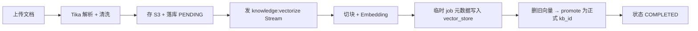

# 模块 04 · 知识库与 RAG（`knowledgebase`）

> 源码：`modules/knowledgebase/`（`KnowledgeBaseController`、`RagChatController`、`service/KnowledgeBaseUploadService`、`KnowledgeBaseParseService`、`KnowledgeBaseVectorService`、`KnowledgeBaseQueryService`、`KnowledgeBaseListService`、`KnowledgeBaseDeleteService`、`RagChatSessionService`、`repository/VectorRepository`、`listener/VectorizeStream*`）  
> 表：`knowledge_bases`、`rag_chat_sessions`、`rag_chat_messages`、`rag_session_knowledge_bases`、`vector_store`（见 [库表设计 §4](../03-db-schema-design.md)）  
> 前端：`/knowledgebase`、`/knowledgebase/upload`、`/knowledgebase/chat`；API `/api/knowledgebase`、`/api/rag-chat`

模块里有两条能力线：**文档管理（写侧：解析 → 切块 → 向量化）** 和 **问答（读侧：检索 → 拼上下文 → 流式生成）**。

---

## 1. 写侧：文档进来变成向量

**向量任务的「临时 → 提升」做法**是这个模块最值得学的一招：

| 阶段 | metadata | 目的 |
|------|----------|------|
| 写入中 | `kb_id=pending:...`、`kb_vector_job_id`、`kb_target_id` | 新向量对查询不可见 |
| 成功 | 删除旧 `kb_id` 向量 → `promoteVectorJob` 改写为正式 `kb_id`，去掉 job 键 | 切换瞬间完成，避免「旧的已删、新的没好」 |
| 失败 | 按 `kb_vector_job_id` 清理临时行，知识库标 `FAILED` | 不留脏向量 |

`VectorRepository` 用 JdbcTemplate 直接操作 `vector_store`（Spring AI 建的表），SQL 里用 `metadata->>'kb_id'` 而非 `?` 操作符——注释里专门说明了这是为了**避开 PostgreSQL `?` 与 JDBC 占位符冲突**。

---

## 2. 读侧：两种问答形态

| 形态 | 接口 | 返回 |
|------|------|------|
| 单次查询 | `POST /api/knowledgebase/query`、`/query/stream` | JSON 或 `Flux<String>` 文本块 |
| 多轮会话 | `POST /api/rag-chat/sessions/{id}/messages/stream` | `Flux<ServerSentEvent<String>>` |

检索链路：问题 → （多轮时）Query Rewrite → Embedding → pgvector COSINE 检索 → TopK + 阈值过滤 → 拼进 `knowledgebase-query-system.st` 的 context → LLM 流式生成。

流式的工程细节：

- 后端用 **WebFlux `Flux`**，不是 `SseEmitter`；
- RAG 会话把换行转义成 `\n` 放进 SSE data，前端 `stream.ts` 再反转义；
- `doOnComplete` 落库完整回答，`doOnError` 落库已生成的部分内容或错误文案——**断流也不会留一条空消息**；
- 检索无命中时直接返回固定「无结果」文案，不去让模型硬编。

---

## 3. 涉及的核心技术要点

| 技术 | 在这个模块的体现 | 深入 |
|------|------------------|------|
| RAG 全链路 | 切块、Embedding、Query Rewrite、TopK/阈值、上下文拼装 | [tech-qa/06](../tech-qa/06-rag.md) |
| pgvector | 1024 维、COSINE、HNSW、`initialize-schema` 自动建表 | 同上 |
| 文档解析与存储 | Tika 抽正文 + 哈希去重 + S3；支持 Markdown 扩展名兜底 | [tech-qa/09](../tech-qa/09-file-storage-parsing.md) |
| Redis Stream 异步 | `knowledge:vectorize:*`，状态 PENDING→PROCESSING→COMPLETED/FAILED | [tech-qa/03](../tech-qa/03-redis.md) |
| SSE 流式 | `Flux` + 前端 fetch/ReadableStream 手工解析 | [tech-qa/08](../tech-qa/08-ai-app-dev-workflow.md) |
| Prompt 模板 | `knowledgebase-query-system/user/rewrite.st` | [tech-qa/05](../tech-qa/05-prompt-engineering.md) |
| 多对多建模 | `rag_session_knowledge_bases` 中间表，会话可绑多个知识库 | [tech-qa/02](../tech-qa/02-jpa-transaction.md) |
| 限流 | query 10+10、query/stream 5+5、upload 3+3、revectorize 2+2 | [tech-qa/10](../tech-qa/10-observability-rate-limit.md) |
| 原生 SQL 逃逸 | `metadata->>'key'` 规避 `?` 冲突、`jsonb_set` 改写元数据 | [tech-qa/02](../tech-qa/02-jpa-transaction.md) |

---

## 4. 数据落点要点

- `knowledge_bases.file_hash` 唯一 → 同一份文档不会重复入库。
- `rag_chat_sessions` 冗余了 `message_count`，并有 `is_pinned`、`ACTIVE/ARCHIVED` 状态；消息用 `message_order` 排序，流式期间 `completed=false`。
- 删除知识库的顺序：清中间表关联 → 删 `vector_store` 向量 → 删对象存储 → 删主表行。
- `chunk_count` 字段存在但当前代码路径**没有回写**，页面上看到 0 不代表没切块。

---

## 5. 我注意到的坑与取舍

| 点 | 说明 |
|----|------|
| SSE 无重试 | 前端单次 `fetch`，断流即结束；已渲染内容虽在，但没有自动续传（学习计划 G7 要补） |
| 检索质量无量化 | 目前靠人工感受调 chunk/TopK，没有评测集（G5 要补） |
| 只用向量检索 | 没有 BM25/混合检索与 Rerank，长尾关键词命中一般 |
| 元数据键较随意 | `kb_id` 与 `kb_id_long` 两种形态并存，删除条件要兼容两者 |
| 5MB 文本上限 | 文件可到 50MB，但 Tika 抽取正文封顶 5MB，超长文档会截断 |
| 向量维度写死 1024 | 换 Embedding 模型要同步改 `dimensions` 和已有向量，否则维度不匹配 |

---

## 6. 想动手改的话

1. **SSE 可靠性**：给 `stream.ts` 加指数退避重试 + 按 messageId 续接，断网不丢已渲染内容。
2. **反馈采集**：给每条 RAG 回答存「有帮助 / 没帮助 + 命中片段」，为后续评测打底。
3. **回写 `chunk_count`**：向量化完成时写入分块数，让列表页状态更可信。
