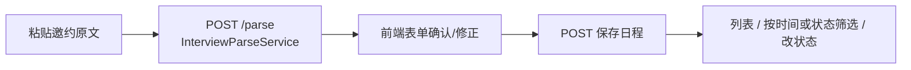

# 模块 05 · 日程管理（`interviewschedule`）

> 源码：`modules/interviewschedule/`（`InterviewScheduleController`、`service/InterviewScheduleService`、`InterviewParseService`、`ScheduleStatusUpdater`、`repository/InterviewScheduleRepository`、`model/*`）  
> 表：`interview_schedule`（见 [库表设计 §5](../03-db-schema-design.md)）  
> 前端：`/interview-schedule`；API `/api/interview-schedule`

这是全项目**最小、最干净**的模块：没有文件、没有向量、没有 WebSocket，一张表 + CRUD + 一个定时任务 + 一次 AI 文本解析。适合作为「读懂 Spring Boot 三层」的第一块样本；分层问答与实读附录见 [tech-qa/01](../tech-qa/01-spring-boot.md)。

---

## 1. 两条链路

**① 手工 / 解析录入**



`InterviewParseService` 把非结构化文本交给 LLM，输出公司、岗位、时间、类型、轮次等字段——**这是「用 LLM 做结构化抽取」的最小示例**，比出题/评估容易读。

**② 定时推进状态**

`ScheduleStatusUpdater` 用 `@Scheduled`（小时级）把「已过时间点却仍是 `PENDING`」的日程批量改为 `CANCELLED`：

```java
@Modifying
@Query("UPDATE InterviewScheduleEntity e SET e.status = :newStatus WHERE ...")
int updateStatusByStatusAndInterviewTimeBefore(...);
```

一条 JPQL 批量 UPDATE，返回影响行数——不是「查出来逐条 save」，避免循环写库。

---

## 2. 分层与方法一览

| 方法 | 做什么 |
|------|--------|
| `create` | request → Entity，`status=PENDING`，`save`，转 DTO |
| `update` | 先 `getByIdOrThrow`；`BeanUtils.copyProperties` 时忽略 `id`/`status` |
| `updateStatus` | 只改状态，与内容更新拆开 |
| `getAll` | 有起止时间 → `Between`；否则有 status → `findByStatus`；否则 `findAll` |
| `getById` / `getByIdOrThrow` | `Optional.orElseThrow(BusinessException)` |
| `delete` | `deleteById` |
| `toDTO` | `BeanUtils.copyProperties` |

Repository 全靠**派生查询**：`findByStatus`、`findByStatusAndInterviewTimeBefore`、`findByInterviewTimeBetween`，加一个 `@Modifying` 批量更新。

---

## 3. 涉及的核心技术要点

| 技术 | 在这个模块的体现 | 深入 |
|------|------------------|------|
| 三层分层与 DI | Controller 薄、Service 定规则、Repository 只碰库；构造器注入 | [tech-qa/01](../tech-qa/01-spring-boot.md) |
| 派生查询命名 | `And` / `Before` / `Between` 如何映射 WHERE | [tech-qa/02](../tech-qa/02-jpa-transaction.md) |
| `@Modifying` 批量更新 | 一条 UPDATE 推进大量行，返回影响行数 | 同上 |
| 枚举持久化 | `@Enumerated(EnumType.STRING)` 存 `PENDING` 而非序号 | 同上 |
| 生命周期回调 | `@PrePersist` / `@PreUpdate` 自动维护时间戳 | 同上 |
| 定时任务 | `@EnableScheduling` + `@Scheduled`（主类已开） | [tech-qa/01](../tech-qa/01-spring-boot.md) |
| LLM 结构化抽取 | 文本 → 结构化字段，`StructuredOutputInvoker` | [tech-qa/11](../tech-qa/11-ai-quality-evaluation.md) |
| 统一响应与异常 | `Result<T>` + `BusinessException(ErrorCode...)` | [tech-qa/01](../tech-qa/01-spring-boot.md) |

---

## 4. 我注意到的坑与取舍

| 点 | 说明 |
|----|------|
| `getAll` 条件互斥 | 同时传时间范围和 status 时**只按时间查**，status 被忽略——接口语义上算个坑 |
| `delete` 不校验存在 | 直接 `deleteById`，删不存在的 id 不会给出业务错误 |
| `COPYABLE_FIELDS` 残留 | 类里定义了常量但没被使用，读代码时容易误以为有用 |
| `BeanUtils.copyProperties` | 浅拷贝同名字段，字段改名后静默不生效；字段多时不如 MapStruct 稳 |
| 状态推进过于简单 | 过期 `PENDING` 一律置 `CANCELLED`，没有「待确认/已完成」的人工二次判断 |
| 无外键 | 与简历/会话完全独立，不参与任何级联 |

---

## 5. 想动手改的话

1. **修 `getAll` 语义**：时间范围与 status 支持组合过滤（Specification 或多个派生方法）。
2. **`delete` 前置校验**：不存在时抛 `BusinessException`，与其他模块行为一致。
3. **改用 MapStruct**：把 `BeanUtils.copyProperties` 换成编译期生成的映射，字段不匹配时编译期就报错。
